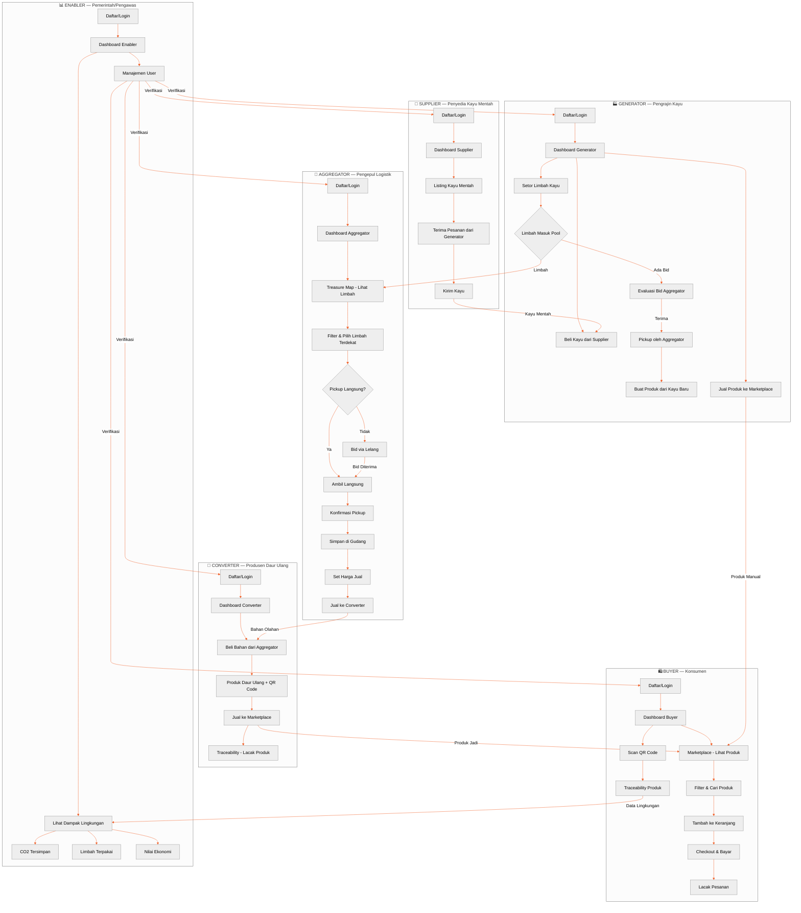

# Workflow Diagram — WoodLoop Circular Economy

## 6 Role & Alur Utama

```
                    ┌─────────────────────────────────────────────────────────────┐
                    │                     WOODLOOP PLATFORM                       │
                    │            Jepara Circular Hub — Ekonomi Sirkular           │
                    └─────────────────────────────────────────────────────────────┘
                                        │
         ┌──────────────────────────────┼──────────────────────────────┐
         │                              │                              │
         ▼                              ▼                              ▼
   ┌──────────┐                  ┌────────────┐               ┌────────────┐
   │ SUPPLIER │                  │ GENERATOR  │               │  BUYER     │
   │ (Kayu    │                  │ (Pengrajin)│               │(Konsumen)  │
   │ Mentah)  │                  │            │               │            │
   └────┬─────┘                  └─────┬──────┘               └──────┬─────┘
        │                              │                             │
        │  ① Jual Kayu Mentah          │                             │
        │─────────────────────────────>│                             │
        │                              │                             │
        │                              │  ⑤ Jual Produk Jadi        │
        │                              │─────────────────────────────│
        │                              │                             │
        │                              │  ② Setor Limbah Kayu       │
        │                              │─────┐                       │
        │                              │     │                       │
        │                              │     ▼                       │
        │                              │  ┌────────────┐            │
        │                              │  │AGGREGATOR  │            │
        │                              │  │(Pengepul)  │            │
        │                              │  └─────┬──────┘            │
        │                              │        │                   │
        │                              │        │  ③ Kumpulkan &    │
        │                              │        │     Sortir Limbah │
        │                              │        ▼                   │
        │                              │  ┌────────────┐            │
        │                              │  │ Gudang     │            │
        │                              │  │ (Warehouse)│            │
        │                              │  └─────┬──────┘            │
        │                              │        │                   │
        │                              │        │  ④ Jual Bahan     │
        │                              │        │     Daur Ulang    │
        │                              │        ▼                   │
        │                              │  ┌────────────┐            │
        │                              │  │ CONVERTER  │            │
        │                              │  │ (Produsen) │            │
        │                              │  └─────┬──────┘            │
        │                              │        │                   │
        │                              │        │  ⑤ Jual Produk   │
        │                              │        │     Jadi          │
        │                              │        │───────────────────│
        │                              │        │                   │
        │                              │        │                   │
        │                              ▼        ▼                   │
        │                       ┌──────────────┐                    │
        │                       │   ENABLER    │                    │
        │                       │  (Pemerintah │                    │
        │                       │  / Pengawas) │                    │
        │                       └──────────────┘                    │
        │                                              ▲           │
        │                                              │           │
        │                       ⑥ Beli Produk         │           │
        │                       <──────────────────────┘           │
        └──────────────────────────────────────────────────────────┘
```

---

## Flow Details (Mermaid)



---

## Alur Sirkular — End-to-End

```
STEP 1 ─── SUPPLIER ───────────────────────────────────────────────
  Supplier mendaftarkan kayu mentah (jenis, diameter, volume, harga)
  → Kayu masuk pool "available"
  
STEP 2 ─── GENERATOR ──────────────────────────────────────────────
  Generator beli kayu dari Supplier
  → Generator olah kayu jadi produk
  → Sisa potongan (limbah) disetor ke platform
  
STEP 3 ─── AGGREGATOR ─────────────────────────────────────────────
  Aggregator lihat peta limbah di sekitar
  → Ambil langsung atau bid via lelang
  → Konfirmasi pickup (foto + GPS + timbangan)
  → Limbah masuk gudang Aggregator
  → Set harga jual per kg
  
STEP 4 ─── CONVERTER ──────────────────────────────────────────────
  Converter beli bahan dari gudang Aggregator
  → Olah jadi produk baru (daur ulang)
  → Generate QR code untuk traceability
  → Jual ke Marketplace
  
STEP 5 ─── BUYER ──────────────────────────────────────────────────
  Buyer browsing Marketplace
  → Lihat produk + dampak lingkungan
  → Beli via cart/checkout
  → Scan QR untuk lihat traceability (asal bahan)
  
STEP 6 ─── ENABLER ────────────────────────────────────────────────
  Enabler lihat dashboard dampak
  → CO₂ tersimpan, limbah teralihkan, nilai ekonomi
  → Verifikasi & manajemen user
```

---

## Hubungan Antar Role (Matriks)

| Role | Supplier | Generator | Aggregator | Converter | Buyer | Enabler |
|------|----------|-----------|------------|-----------|-------|---------|
| **Supplier** | — | Jual kayu | — | — | — | — |
| **Generator** | Beli kayu | — | Setor limbah | — | Jual produk | — |
| **Aggregator** | — | Ambil limbah | — | Jual bahan | — | — |
| **Converter** | — | — | Beli bahan | — | Jual produk | — |
| **Buyer** | — | — | — | Beli produk | — | — |
| **Enabler** | Verifikasi | Verifikasi | Verifikasi | Verifikasi | Verifikasi | — |

---

## Teknologi per Role

| Role | Halaman Utama | Fitur Kunci |
|------|---------------|-------------|
| **Supplier** | Dashboard, Inventaris, Pesanan, Penjualan | CRUD kayu, manajemen stok |
| **Generator** | Dashboard, Setor Limbah, Beli Kayu, Produk | Waste form stepper, bidding |
| **Aggregator** | Dashboard, Treasure Map, Pickup, Gudang, Lelang | Leaflet map, GPS, polyline routing |
| **Converter** | Dashboard, Pasar Bahan, Katalog, Klinik Desain | QR code, design clinic |
| **Buyer** | Marketplace, Pesanan, Cart, Checkout, Scan QR | SSR/ISR, checkout flow |
| **Enabler** | Dashboard, Manajemen User | Charts, impact metrics |
