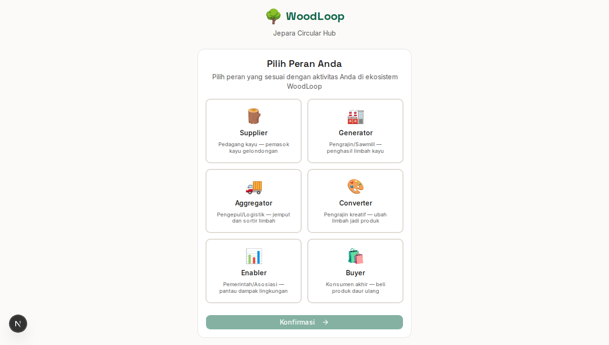
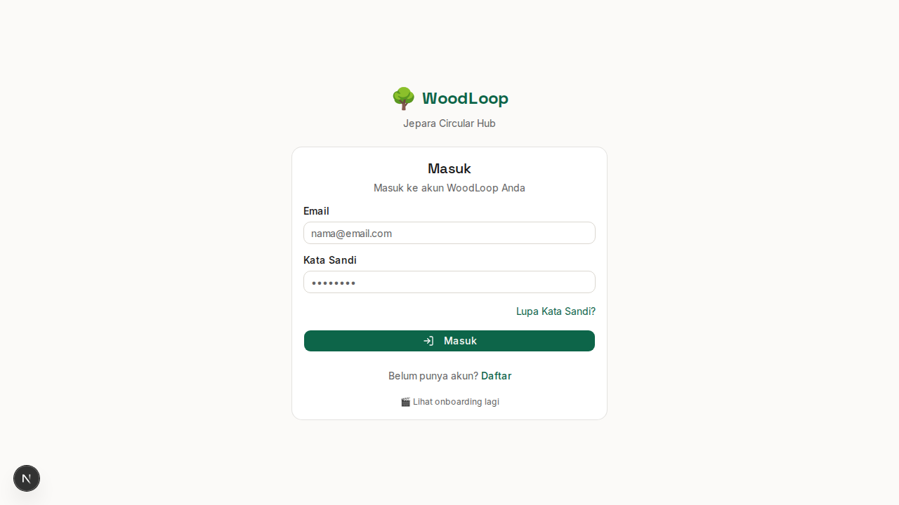
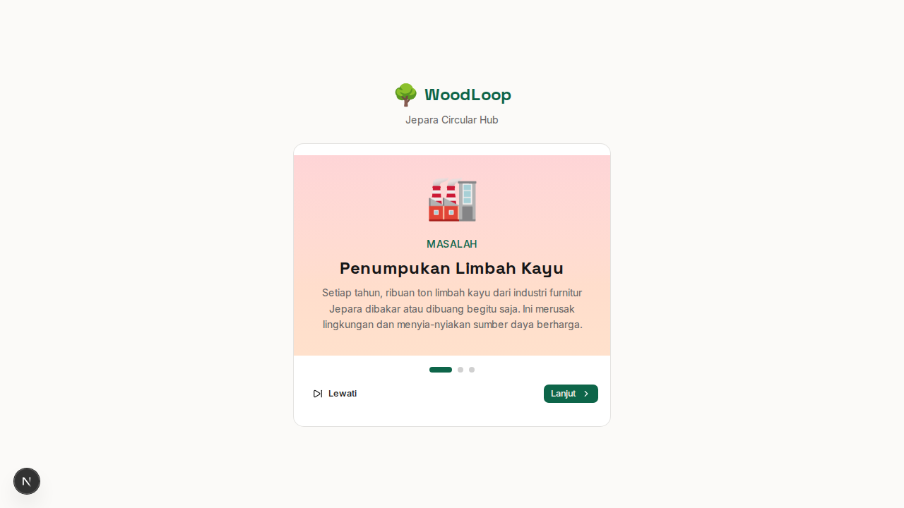

# Bab 2: Memulai

---

## 2.1 Cara Mengakses Aplikasi

WoodLoop dapat diakses melalui **tiga cara**:

### 🌐 2.1.1 Web Browser (Desktop / Mobile)

Cara paling mudah — cukup buka browser dan kunjungi:

```
https://woodloop.app
```

**Tidak perlu install apapun.** Cukup buka URL di browser Chrome, Firefox, Safari, atau Edge.

**Keunggulan akses web:**
- Langsung bisa digunakan tanpa instalasi
- Cocok untuk Buyer (konsumen) dan Enabler (pemerintah) yang akses dari laptop
- Halaman traceability produk bisa diakses siapa saja tanpa login
- Produk muncul di hasil pencarian Google (SEO)

### 📱 2.1.2 Install Sebagai PWA (Progressive Web App)

PWA memungkinkan website WoodLoop diinstall seperti aplikasi native di perangkat Anda.

**Cara install PWA di Chrome (Android/Desktop):**

| Langkah | Desktop | Android |
|---------|---------|---------|
| 1 | Buka `woodloop.app` di Chrome | Buka `woodloop.app` di Chrome |
| 2 | Klik ikon **install** (➕) di address bar | Ketuk menu (⋮) → **Install WoodLoop** |
| 3 | Klik **Install** pada dialog | Ketuk **Install** |
| 4 | WoodLoop muncul sebagai aplikasi | WoodLoop muncul di home screen |

**Keunggulan PWA:**
- ✅ Tampil sebagai aplikasi standalone (tanpa address bar browser)
- ✅ Bisa diakses offline untuk halaman yang sudah dikunjungi
- ✅ Lebih cepat karena asset di-cache
- ✅ Ukuran sangat kecil dibanding APK native

### 📲 2.1.3 Install APK Android (Native Capacitor)

Untuk pengalaman **paling optimal** — terutama untuk role yang bekerja di lapangan (Generator, Aggregator, Supplier) — install aplikasi Android native.

**Persyaratan:**
- Android 8.0 (API 26) atau lebih baru
- RAM minimal 3 GB
- Izin: Kamera, GPS, Notifikasi, Penyimpanan

**Cara install APK:**
1. Buka halaman download di `woodloop.app/download`
2. Download file `WoodLoop-v1.0.apk`
3. Buka file APK yang sudah di-download
4. Jika muncul peringatan keamanan, pilih **Tetap Install** / **Install Anyway**
5. Tunggu hingga proses instalasi selesai
6. Buka aplikasi WoodLoop dari menu aplikasi

> **Catatan:** Pada beberapa perangkat Xiaomi, Oppo, atau Vivo, Anda perlu mengizinkan "Install dari sumber tidak dikenal" di Pengaturan → Keamanan.

**Keunggulan APK Native:**
- ✅ Kamera native — foto limbah dengan kualitas terbaik
- ✅ GPS native — lokasi akurat untuk Treasure Map
- ✅ Push notification — notifikasi realtime meskipun aplikasi tertutup
- ✅ QR Scanner native — scan QR lebih cepat
- ✅ Biometric — akses wallet dengan fingerprint

---

## 2.2 Registrasi Akun

Sebelum menggunakan WoodLoop, Anda perlu mendaftar akun terlebih dahulu. Ikuti langkah-langkah berikut:

### Langkah 1: Buka Halaman Registrasi

1. Buka `https://woodloop.app`
2. Klik tombol **"Daftar"** atau **"Register"** di halaman awal
3. Atau buka langsung: `https://woodloop.app/register`


*Gambar 2.1 — Halaman registrasi akun WoodLoop*

### Langkah 2: Isi Data Diri

Form registrasi membutuhkan data berikut:

| Field | Keterangan | Contoh |
|-------|------------|--------|
| **Nama Lengkap** | Nama sesuai identitas | "Budi Santoso" |
| **Email** | Email aktif untuk konfirmasi | "budi@email.com" |
| **Nomor Telepon** | Nomor WhatsApp aktif | "081234567890" |
| **Kata Sandi** | Minimal 8 karakter | "********" |
| **Konfirmasi Sandi** | Ketik ulang kata sandi | "********" |

### Langkah 3: Pilih Peran

Setelah mengisi data diri, Anda akan diminta memilih **peran**:


*Gambar 2.2 — Pilih peran sesuai kegiatan Anda*

Pilih salah satu dari 6 peran. Lihat [Bab 1.2](./01-bab-1-pendahuluan.md#12-siapa-saja-penggunanya) jika bingung memilih peran.

> ⚠️ **Penting:** Peran **tidak bisa diubah** setelah registrasi. Pastikan Anda memilih peran yang tepat.

### Langkah 4: Isi Data Tambahan (Sesuai Peran)

Setiap peran memiliki form tambahan yang perlu diisi:

| Peran | Field Tambahan |
|-------|----------------|
| **Supplier** | Nama workshop, alamat, kapasitas produksi |
| **Generator** | Nama workshop, jenis mesin, kapasitas produksi |
| **Aggregator** | Jenis armada, kapasitas gudang, wilayah operasi |
| **Converter** | Nama workshop, spesialisasi, kapasitas produksi |
| **Buyer** | Alamat pengiriman |
| **Enabler** | Nama instansi, jabatan |

### Langkah 5: Konfirmasi & Selesai

1. Periksa kembali data yang diisi
2. Klik **"Daftar"** / **"Register"**
3. Anda akan diarahkan ke dashboard sesuai peran
4. Selamat! Akun WoodLoop Anda sudah aktif 🎉

> **Tips:** Setelah registrasi, segera lengkapi profil dan upload dokumen legalitas untuk mendapatkan badge "Terverifikasi". Akun terverifikasi mendapatkan kepercayaan lebih dari pengguna lain.

---

## 2.3 Login & Logout

### 2.3.1 Login

1. Buka `https://woodloop.app/login`
2. Masukkan **Email** yang terdaftar
3. Masukkan **Kata Sandi**
4. Klik tombol **"Masuk"**


*Gambar 2.3 — Halaman login WoodLoop*

**Tips login:**
- Pastikan koneksi internet stabil
- Gunakan email yang sama saat registrasi
- Kata sandi bersifat **case-sensitive** (huruf besar/kecil berpengaruh)

### 2.3.2 Lupa Kata Sandi

Jika lupa kata sandi:

1. Di halaman login, klik **"Lupa Kata Sandi?"**
2. Masukkan email yang terdaftar
3. Cek email Anda — tautan reset akan dikirim
4. Klik tautan di email
5. Buat kata sandi baru (minimal 8 karakter)
6. Login dengan kata sandi baru

> ⏳ Tautan reset berlaku **1 jam**. Jika kedaluwarsa, ulangi proses.

### 2.3.3 Logout

1. Klik **avatar / inisial** di pojok kanan atas
2. Pilih **"Keluar"** / **"Logout"**
3. Anda akan kembali ke halaman login

> **Tips keamanan:**
> - Selalu logout setelah selesai menggunakan aplikasi di perangkat umum
> - Jangan simpan kata sandi di browser publik
> - Gunakan kata sandi yang unik (tidak dipakai di aplikasi lain)

### 2.3.4 Masalah Login Umum

| Masalah | Solusi |
|---------|--------|
| **Email tidak terdaftar** | Periksa kembali email, atau daftar akun baru |
| **Kata sandi salah** | Gunakan fitur "Lupa Kata Sandi" untuk reset |
| **Akun diblokir** | Hubungi admin Enabler melalui email support |
| **Halaman tidak bisa diakses** | Pastikan Anda login dengan peran yang benar |
| **Tetap di halaman login** | Hapus cache browser, atau gunakan mode incognito |

---

## 2.4 Onboarding & Pemilihan Peran

### 2.4.1 Slide Onboarding

Saat pertama kali membuka WoodLoop (tanpa login), Anda akan melihat **3 slide onboarding** yang menjelaskan konsep platform:


*Gambar 2.4 — Slide onboarding WoodLoop*

| Slide | Judul | Isi |
|-------|-------|-----|
| **Slide 1** | 💡 Digitalisasi Limbah | "Ubah limbah kayu Anda menjadi aset berharga. Catat, kelola, dan jual limbah dengan mudah." |
| **Slide 2** | 🚚 Logistik Cerdas | "Treasure Map memudahkan penjemputan limbah. Aggregator bisa melihat lokasi limbah secara realtime." |
| **Slide 3** | 🌱 Dampak Terlacak | "Setiap produk punya cerita. QR Traceability memungkinkan pembeli melihat asal-usul produk." |

**Navigasi:**
- Geser ke kiri/kanan untuk berpindah slide
- Klik **"Lewati"** untuk langsung ke halaman login/registrasi
- Klik **"Mulai"** di slide terakhir untuk lanjut

### 2.4.2 Pemilihan Peran

Setelah onboarding (atau saat registrasi), Anda akan memilih **1 dari 6 peran**:

| Role | Icon | Warna |
|------|------|-------|
| 🌲 **Supplier** | Pohon | Hijau |
| 🏭 **Generator** | Pabrik | Orange |
| 🚛 **Aggregator** | Truk | Biru |
| ♻️ **Converter** | Daur ulang | Ungu |
| 🛒 **Buyer** | Belanja | Pink |
| 📊 **Enabler** | Grafik | Emas |

**Cara memilih:**
1. Baca deskripsi setiap peran
2. Tap / klik kartu peran yang sesuai
3. Klik **"Konfirmasi"** atau **"Pilih"**
4. Anda akan diarahkan ke dashboard peran tersebut

> **Tips:** Jika ragu dengan peran yang tepat, baca kembali [Bab 1.2 — Siapa Saja Penggunanya?](./01-bab-1-pendahuluan.md#12-siapa-saja-penggunanya)

---

## 2.5 Profil & Verifikasi Akun

### 2.5.1 Mengakses Profil

1. Klik **avatar / inisial** di pojok kanan atas header
2. Pilih **"Profil"** dari dropdown menu
3. Atau buka langsung: `https://woodloop.app/profile`


*Gambar 2.5 — Halaman profil pengguna*

### 2.5.2 Mengedit Profil

Di halaman profil, Anda dapat mengubah:

| Field | Keterangan |
|-------|------------|
| **Foto Profil** | Upload foto atau ambil dari kamera |
| **Nama** | Nama lengkap |
| **Bio** | Deskripsi singkat tentang Anda / usaha |
| **Nomor Telepon** | Kontak yang bisa dihubungi |
| **Alamat** | Lokasi workshop / rumah |
| **Workshop** | Nama bengkel atau perusahaan |
| **Media Sosial** | Link Instagram, website, dll |

**Cara edit:**
1. Klik ikon **pensil (✏️)** pada field yang ingin diubah
2. Masukkan data baru
3. Klik **"Simpan"**

### 2.5.3 Verifikasi Akun

Akun **terverifikasi** mendapatkan badge centang biru (✓) yang menandakan bahwa identitas Anda sudah dikonfirmasi oleh admin WoodLoop (Enabler). Akun terverifikasi lebih dipercaya dalam transaksi.

**Keuntungan verifikasi:**

| Keuntungan | Supplier | Generator | Aggregator | Converter | Buyer | Enabler |
|------------|:--------:|:---------:|:----------:|:---------:|:-----:|:-------:|
| Badge centang biru | ✅ | ✅ | ✅ | ✅ | ✅ | ✅ |
| Prioritas di pencarian | ✅ | ✅ | ✅ | ✅ | — | — |
| Limit transaksi lebih tinggi | ✅ | ✅ | ✅ | ✅ | ✅ | — |
| Akses bidding premium | — | ✅ | ✅ | — | — | — |

**Cara verifikasi:**
1. Buka halaman **Profil**
2. Klik **"Ajukan Verifikasi"** di bagian status akun
3. Upload dokumen pendukung:
   - **Supplier:** SIUP / NIB, dokumen legalitas kayu (SVLK/FSC)
   - **Generator:** SIUP / NIB
   - **Aggregator:** SIUP, izin gudang
   - **Converter:** SIUP / NIB
   - **Buyer:** KTP
   - **Enabler:** SK pengangkatan / surat tugas
4. Klik **"Kirim"**
5. Admin akan memproses verifikasi dalam **1×24 jam**
6. Anda akan mendapat notifikasi saat verifikasi selesai

### 2.5.4 Dokumen Legalitas

WoodLoop mendukung upload dokumen legalitas untuk mendukung verifikasi:

| Dokumen | Format | Ukuran Maks |
|---------|--------|-------------|
| KTP | JPG, PNG | 2 MB |
| SIUP / NIB | PDF, JPG, PNG | 5 MB |
| SVLK | PDF | 5 MB |
| FSC Certificate | PDF | 5 MB |
| Surat izin gudang | PDF, JPG | 5 MB |
| NPWP | PDF, JPG | 2 MB |

---

### Ringkasan Bab 2

| Langkah | Kegiatan | Halaman |
|---------|----------|---------|
| **1** | Akses aplikasi (Web / PWA / APK) | `woodloop.app` |
| **2** | Registrasi akun + pilih peran | `/register` |
| **3** | Login dengan email & password | `/login` |
| **4** | Ikuti onboarding (pertama kali) | `/onboarding` |
| **5** | Lengkapi profil & verifikasi akun | `/profile` |

---
➡️ **Lanjut ke [Bab 3: Navigasi Umum](./03-bab-3-navigasi-umum.md)**
