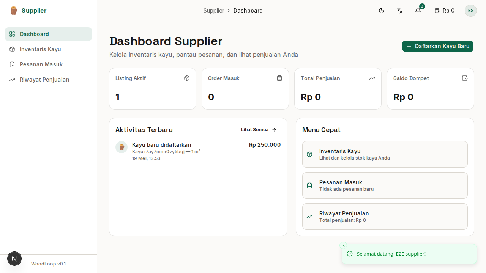
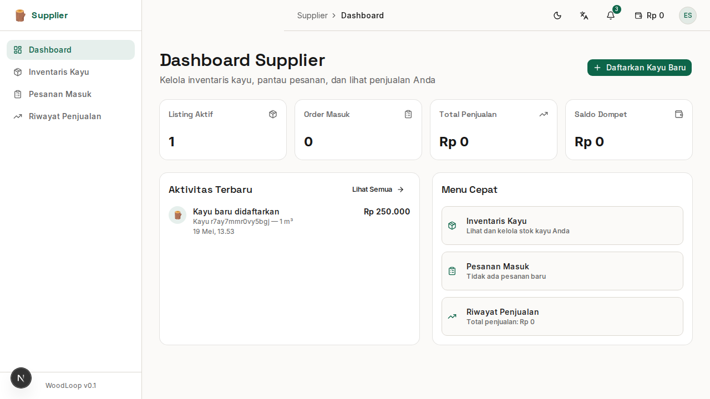

# Bab 4: Panduan Supplier (Pemasok Kayu)

---

**Supplier** adalah pihak yang memasok kayu gelondongan (*raw timber*) ke dalam ekosistem WoodLoop. Supplier menjadi **mata rantai pertama** dalam alur ekonomi sirkular.

**Contoh pengguna Supplier:** Pedagang kayu di Jepara, pemilik sawmill, pemilik hutan rakyat.

---

## 4.1 Dashboard Supplier

Setelah login sebagai Supplier, halaman pertama yang muncul adalah **Dashboard Supplier**.

*Gambar 4.1 — Dashboard Supplier dengan summary cards dan aktivitas terbaru*

### Ringkasan Kartu (Summary Cards)

| Kartu | Menampilkan |
|-------|-------------|
| 📦 **Listing Aktif** | Jumlah kayu yang sedang dijual |
| 📋 **Order Masuk** | Jumlah pesanan dari Generator (pending) |
| 💰 **Total Penjualan** | Total pendapatan dari semua transaksi |
| 👛 **Saldo Dompet** | Saldo dompet digital WoodLoop |

### Aktivitas Terbaru

Di bagian bawah dashboard, terdapat daftar **aktivitas terbaru** seperti:
- ✅ Kayu baru berhasil didaftarkan
- 📦 Ada order masuk dari Generator
- 💰 Pembayaran masuk

### Menu Cepat (Quick Actions)

| Tombol Aksi | Fungsi | Navigasi ke |
|-------------|--------|-------------|
| **Daftarkan Kayu Baru** | Tambah listing kayu baru | `/supplier/inventory/new` |
| **Lihat Inventaris** | Lihat semua stok kayu | `/supplier/inventory` |
| **Lihat Pesanan** | Cek pesanan masuk | `/supplier/orders` |

---

## 4.2 Mendaftarkan Kayu Baru

Ini adalah fitur utama Supplier — mendaftarkan kayu gelondongan yang ingin dijual.

### Buka Form Tambah Kayu

1. Dari dashboard, klik **"Daftarkan Kayu Baru"**
2. Atau buka menu sidebar **"Inventaris Kayu"** → klik **"Daftarkan Kayu Baru"**
3. Atau langsung: `/supplier/inventory/new`

*Gambar 4.2 — Form pendaftaran kayu baru*

### Isi Detail Kayu

| Field | Tipe Input | Wajib | Contoh |
|-------|-----------|:-----:|--------|
| **Jenis Kayu** | Dropdown | ✅ | Jati, Mahoni, Sono Keling, Akasia |
| **Diameter (cm)** | Angka | ✅ | 30 |
| **Panjang (cm)** | Angka | ✅ | 200 |
| **Volume (m³)** | Angka | ✅ | 0.5 |
| **Harga** | Angka (Rp) | ✅ | 500000 |
| **Satuan** | Dropdown | ✅ | m³, batang, ton |
| **Deskripsi** | Text area | ❌ | Kayu jati kering, kualitas A |
| **Kondisi** | Dropdown | ✅ | Kering, Basah, Olahan |

### Upload Foto

| Ketentuan | Detail |
|-----------|--------|
| Minimal foto | **1 foto** (wajib) |
| Maksimal foto | **5 foto** |
| Format | JPG, PNG, WebP |
| Ukuran maks | **2 MB per foto** |

**Cara upload:**
- Seret (*drag & drop*) foto ke area dropzone
- Atau klik area dropzone untuk memilih file dari komputer
- Foto akan tampil sebagai preview setelah di-upload

### Upload Dokumen Legalitas (Opsional)

| Dokumen | Format | Kegunaan |
|---------|--------|----------|
| SVLK Certificate | PDF | Legalitas kayu bersertifikat |
| FSC Certificate | PDF | Sertifikasi pengelolaan hutan |
| SIUP / NIB | PDF / JPG | Izin usaha |

### Simpan

1. Pastikan semua field wajib terisi
2. Klik **"Simpan Kayu"**
3. Jika berhasil, akan muncul notifikasi **"Kayu berhasil didaftarkan!"**
4. Kayu akan muncul di **Inventaris** dan bisa dilihat oleh Generator di marketplace

> ⚠️ **Tips:** Kayu dengan foto yang jelas dan deskripsi lengkap lebih cepat laku. Sertakan sertifikat legalitas untuk meningkatkan kepercayaan pembeli.

---

## 4.3 Mengelola Inventaris Kayu

Halaman **Inventaris Kayu** menampilkan semua kayu yang telah Anda daftarkan.

*Gambar 4.3 — Halaman inventaris kayu Supplier*

### Fitur Halaman Inventaris

| Fitur | Fungsi |
|-------|--------|
| 🔍 **Pencarian** | Cari berdasarkan jenis kayu |
| 📊 **Filter Status** | Filter: Semua, Tersedia, Terjual, Dipesan |
| 🪵 **Filter Jenis Kayu** | Filter berdasarkan jenis kayu |
| 🔄 **Reset Filter** | Kembalikan filter ke default |
| 📝 **Edit** | Ubah data kayu (harga, volume, dll) |
| 🗑️ **Hapus** | Hapus listing kayu (dengan konfirmasi) |

### Status Kayu

| Status | Arti | Warna Badge |
|--------|------|-------------|
| 🟢 **Tersedia** | Kayu siap dijual | Hijau |
| 🟡 **Dipesan** | Sedang dalam proses pemesanan | Kuning |
| 🔴 **Terjual** | Sudah dibeli Generator | Merah |

### Edit Kayu

1. Klik ikon **pensil (✏️)** pada baris kayu yang ingin diedit
2. Ubah field yang diperlukan
3. Klik **"Simpan"**

### Hapus Kayu

1. Klik ikon **tong sampah (🗑️)** pada baris kayu
2. Dialog konfirmasi akan muncul
3. Klik **"Hapus"** untuk mengonfirmasi, atau **"Batal"** untuk membatalkan

> ⚠️ Kayu yang sudah memiliki pesanan aktif **tidak bisa dihapus**. Hapus hanya untuk kayu yang belum ada peminat.

---

## 4.4 Melihat & Memproses Pesanan Masuk

Halaman **Pesanan Masuk** menampilkan semua order dari Generator yang memesan kayu Anda.

*Gambar 4.4 — Halaman pesanan masuk Supplier*

### Status Pesanan

| Status | Arti | Aksi Supplier |
|--------|------|---------------|
| ⏳ **Menunggu Bayar** | Generator sudah pesan, belum bayar | Tunggu pembayaran |
| ✅ **Dibayar** | Pembayaran sudah dikonfirmasi | Siapkan pengiriman |
| 🚚 **Dikirim** | Kayu sedang dalam perjalanan | — |
| 📦 **Diterima** | Generator sudah terima | Transaksi selesai |
| ❌ **Dibatalkan** | Pesanan dibatalkan | — |

### Detail Pesanan

Klik ikon **mata (👁️)** pada baris pesanan untuk melihat detail:

| Informasi | Detail |
|-----------|--------|
| **Pembeli** | Nama Generator + kontak |
| **Kayu** | Jenis, volume, harga |
| **Total** | Jumlah yang harus dibayar |
| **Alamat** | Lokasi pengiriman |
| **Tanggal** | Waktu pemesanan |

---

## 4.5 Riwayat Penjualan & Grafik

Halaman **Riwayat Penjualan** menampilkan data penjualan Anda dalam bentuk grafik dan tabel.

*Gambar 4.5 — Halaman riwayat penjualan dengan grafik*

### Ringkasan Kartu

| Kartu | Menampilkan |
|-------|-------------|
| 💰 **Total Pendapatan** | Jumlah rupiah dari semua penjualan |
| ✅ **Pesanan Selesai** | Jumlah transaksi yang selesai |
| 🔄 **Total Transaksi** | Total semua transaksi (termasuk pending) |

### Grafik Penjualan per Bulan

Grafik batang (*bar chart*) menampilkan tren penjualan bulanan. Dataset akan terisi setelah ada transaksi.

### Daftar Transaksi

Tabel riwayat transaksi lengkap dengan:
- Tanggal transaksi
- Nama pembeli (Generator)
- Jenis kayu
- Volume
- Total harga
- Status

> **Tips:** Jika belum ada penjualan, halaman akan menampilkan status **"Belum ada transaksi"**. Mulai dengan mendaftarkan kayu berkualitas!

---

### Ringkasan Bab 4

| Fitur | Halaman | Fungsi Utama |
|-------|---------|-------------|
| Dashboard | `/supplier/dashboard` | Ringkasan aktivitas & menu cepat |
| Tambah Kayu | `/supplier/inventory/new` | Daftarkan kayu baru (foto + data) |
| Inventaris | `/supplier/inventory` | Kelola stok, edit, hapus |
| Pesanan | `/supplier/orders` | Lihat & proses order Generator |
| Penjualan | `/supplier/sales` | Grafik & riwayat penjualan |

---
➡️ **Lanjut ke [Bab 5: Panduan Generator](./05-bab-5-generator.md)**
