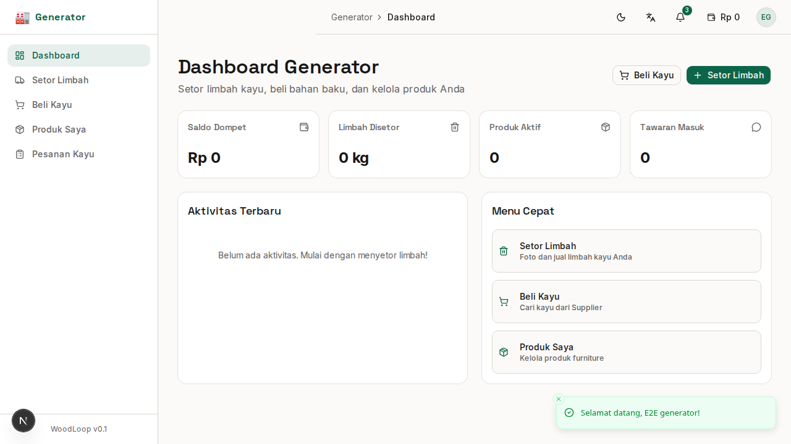
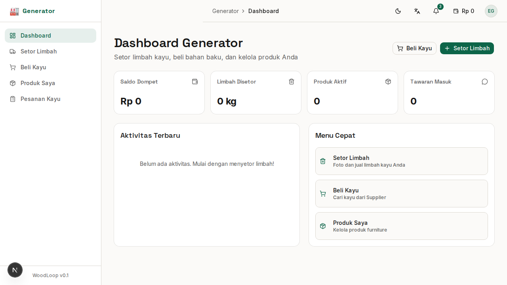

# Bab 5: Panduan Generator (Penghasil Limbah)

---

**Generator** adalah pihak yang **menghasilkan limbah kayu** dari proses produksi mebel atau penggergajian. Generator memegang peran kunci dalam ekonomi sirkular karena mereka adalah **sumber utama limbah** yang bisa diolah kembali.

**Contoh pengguna Generator:** Pengrajin mebel, pemilik sawmill, workshop kayu.

---

## 5.1 Dashboard Generator

Setelah login sebagai Generator, halaman pertama adalah **Dashboard Generator**.


*Gambar 5.1 — Dashboard Generator dengan summary cards*

### Ringkasan Kartu

| Kartu | Menampilkan |
|-------|-------------|
| 👛 **Saldo Dompet** | Saldo dari penjualan limbah |
| 🗑️ **Limbah Disetor** | Total limbah yang sudah disetor |
| 📦 **Produk Aktif** | Jumlah produk generator aktif |
| 📨 **Tawaran Masuk** | Jumlah bidding dari Aggregator |

### Menu Cepat (Quick Actions)

| Tombol | Fungsi | Navigasi |
|--------|--------|----------|
| 🗑️ **Setor Limbah** | Mulai proses setor limbah | `/generator/report-waste` |
| 🪵 **Beli Kayu** | Cari dan beli kayu dari Supplier | `/generator/buy-timber` |

---

## 5.2 Setor Limbah (Report Waste)

Fitur utama Generator — melaporkan limbah kayu yang ingin dijual. Prosesnya terdiri dari **4 langkah**:


*Gambar 5.2 — Form setor limbah multi-step*

### Langkah 1: Foto Limbah

| Ketentuan | Detail |
|-----------|--------|
| Minimal foto | **1 foto** |
| Maksimal foto | **5 foto** |
| Format | JPG, PNG, WebP |
| Saran | Ambil dari beberapa sudut untuk hasil terbaik |

**Cara:** Klik tombol **"Ambil Foto Limbah"** — kamera akan terbuka (atau file dialog di web).

### Langkah 2: Jenis & Bentuk Limbah

| Field | Tipe Input | Contoh |
|-------|-----------|--------|
| **Jenis Kayu** | Dropdown | Jati, Mahoni, Sono Keling |
| **Bentuk Limbah** | Pilihan grid | Offcut besar/kecil, Shaving, Sawdust, Logs end |
| **Kondisi** | Dropdown | Kering, Basah, Berminyak, Campuran |

### Langkah 3: Volume & Harga

| Field | Tipe Input | Contoh |
|-------|-----------|--------|
| **Volume** | Angka | 50 |
| **Satuan** | Dropdown | kg, m³, karung, pickup |
| **Estimasi Harga** | Angka (Rp) | 50000 |
| **Deskripsi** | Text area | Limbah potongan kursi, ukuran 10-20cm |

### Langkah 4: Konfirmasi

Ringkasan data yang sudah diisi — periksa kembali sebelum mengirim.

1. Preview foto
2. Detail jenis & bentuk limbah
3. Volume & harga
4. Klik **"Setor Limbah"** untuk mengirim

> ✅ Berhasil! Limbah Anda akan muncul di daftar limbah yang bisa dilihat oleh Aggregator.

### Progress Bar

Setiap langkah ditandai dengan progress bar:

```
Langkah 1: [████████░░░░] 25% — Foto Limbah
Langkah 2: [████████████░░] 50% — Jenis & Bentuk
Langkah 3: [██████████████░░] 75% — Volume & Harga
Langkah 4: [████████████████] 100% — Konfirmasi
```

---

## 5.3 Jenis & Bentuk Limbah

WoodLoop mengklasifikasikan limbah kayu ke dalam beberapa kategori:

| Bentuk Limbah | Ilustrasi | Contoh Penggunaan |
|---------------|-----------|-------------------|
| 🪵 **Offcut Besar** | Potongan kayu > 30cm | Bisa diolah jadi produk kecil |
| 🔲 **Offcut Kecil** | Potongan kayu < 30cm | Cocok untuk sambungan, inlay |
| 🪶 **Shaving** | Serutan tipis | Bahan baku particle board, kompos |
| 🌫️ **Sawdust** | Serbuk gergaji | Bahan baku briket, jamur |
| 🪓 **Logs End** | Ujung kayu gelondongan | Bisa diolah jadi ukiran kecil |

| Kondisi | Arti |
|---------|------|
| ☀️ **Kering** | Kadar air rendah, siap pakai |
| 💧 **Basah** | Baru dipotong, kadar air tinggi |
| 🛢️ **Berminyak** | Mengandung minyak kayu alami |
| 🔀 **Campuran** | Berbagai jenis/kondisi dalam satu lot |

---

## 5.4 Beli Kayu Mentah

Generator juga bisa **membeli kayu mentah** dari Supplier untuk bahan baku produksi.


*Gambar 5.4 — Halaman beli kayu mentah*

### Fitur Halaman

| Fitur | Fungsi |
|-------|--------|
| 🔍 **Pencarian** | Cari kayu berdasarkan jenis atau kata kunci |
| 🪵 **Filter Jenis Kayu** | Tampilkan hanya jenis kayu tertentu |
| 💰 **Filter Harga** | Tentukan range harga (min - maks) |
| 🔄 **Reset Filter** | Kembalikan semua filter ke default |

### Kartu Kayu

Setiap kayu ditampilkan dalam bentuk kartu berisi:
- 🖼️ **Foto** kayu
- 🪵 **Jenis kayu**
- 📏 **Volume** (m³)
- 💰 **Harga**
- 👤 **Nama Supplier**
- ✅ Tombol **"Pesan Sekarang"**

### Proses Pemesanan

1. Cari kayu yang diinginkan
2. Klik **"Pesan Sekarang"**
3. Sistem akan membuat pesanan
4. Status: **Menunggu Pembayaran**
5. Lakukan pembayaran ke Supplier
6. Supplier akan memproses pengiriman

---

## 5.5 Mengelola Pesanan Kayu

Halaman **Pesanan Kayu** menampilkan semua pesanan kayu yang Anda buat ke Supplier.

### Status Pesanan

| Status | Arti |
|--------|------|
| ⏳ **Menunggu Bayar** | Pesanan dibuat, belum dibayar |
| ✅ **Dibayar** | Pembayaran dikonfirmasi |
| 🚚 **Dikirim** | Kayu sedang dikirim Supplier |
| 📦 **Diterima** | Kayu sudah sampai |
| ❌ **Dibatalkan** | Pesanan dibatalkan |

### Membatalkan Pesanan

Pesanan dengan status **"Menunggu Bayar"** bisa dibatalkan:
1. Klik tombol **"Batal"** pada baris pesanan
2. Konfirmasi di dialog yang muncul
3. Pesanan akan berubah status menjadi **"Dibatalkan"**

> ⚠️ Pesanan dengan status **"Dibayar"** atau selanjutnya **tidak bisa dibatalkan** melalui sistem. Hubungi Supplier langsung via Chat.

---

## 5.6 Produk Saya

Generator juga bisa mendaftarkan **produk kayu/mebel** yang dijual sendiri.


*Gambar 5.6 — Halaman produk Generator*

### Menambahkan Produk Baru

1. Klik **"Tambah Produk"**
2. Isi form:

| Field | Wajib | Keterangan |
|-------|:-----:|------------|
| Nama Produk | ✅ | Contoh: "Meja Jati Minimalis" |
| Kategori | ✅ | Meja, Kursi, Dekorasi, dll |
| Jenis Kayu | ✅ | Jati, Mahoni, dll |
| Harga | ✅ | Dalam Rupiah |
| Stok | ✅ | Jumlah unit tersedia |
| Deskripsi | ❌ | Cerita tentang produk |
| Foto | ✅ | Minimal 1 foto |

3. Klik **"Simpan"**

### Mengelola Produk

| Aksi | Cara |
|------|------|
| **Edit** | Klik ikon pensil pada baris produk |
| **Hapus** | Klik ikon tong sampah → konfirmasi |
| **Lihat** | Klik nama produk untuk detail |

---

### Ringkasan Bab 5

| Fitur | Halaman | Fungsi Utama |
|-------|---------|-------------|
| Dashboard | `/generator/dashboard` | Ringkasan saldo & aktivitas |
| Setor Limbah | `/generator/report-waste` | 4 langkah setor limbah |
| Jenis Limbah | — | Offcut, shaving, sawdust, dll |
| Beli Kayu | `/generator/buy-timber` | Marketplace kayu dari Supplier |
| Pesanan Kayu | `/generator/timber-orders` | Status pembelian kayu |
| Produk Saya | `/generator/products` | CRUD produk generator |

---
➡️ **Lanjut ke [Bab 6: Panduan Aggregator](./06-bab-6-aggregator.md)**
