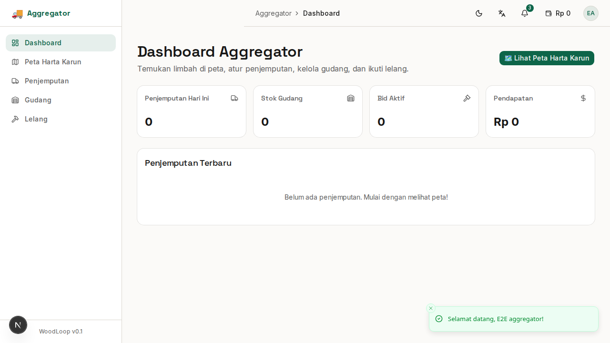
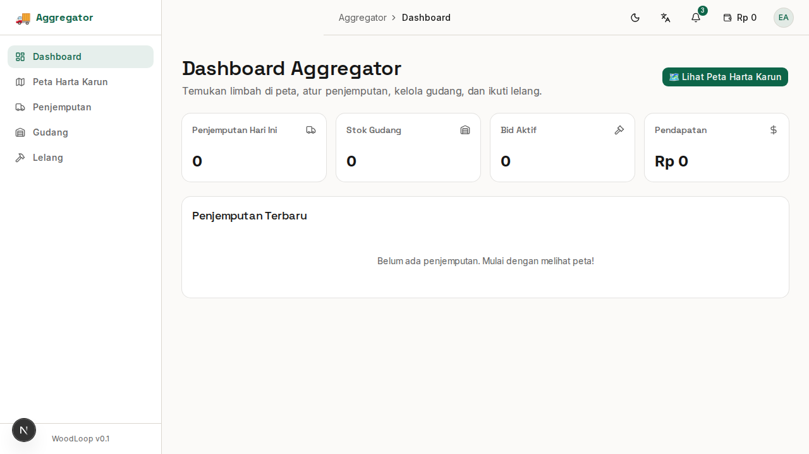

# Bab 6: Panduan Aggregator (Pengepul & Logistik)

---

**Aggregator** adalah pihak yang **menjemput limbah** dari Generator, menyortirnya, menyimpannya di gudang, dan menjualnya ke Converter. Aggregator adalah **jembatan logistik** dalam ekosistem WoodLoop.

**Contoh pengguna Aggregator:** Pengepul kayu, jasa angkutan, pemilik gudang sortir.

---

## 6.1 Dashboard Aggregator

Setelah login sebagai Aggregator, halaman pertama adalah **Dashboard Aggregator**.

*Gambar 6.1 — Dashboard Aggregator*

### Ringkasan Kartu

| Kartu | Menampilkan |
|-------|-------------|
| 🚚 **Penjemputan Hari Ini** | Jumlah pickup yang perlu dijadwalkan |
| 🏗️ **Stok Gudang** | Total volume limbah di gudang (ton) |
| 💰 **Nilai Stok** | Estimasi nilai total stok gudang |
| 📨 **Bid Aktif** | Jumlah bidding yang sedang berjalan |

---

## 6.2 Treasure Map (Peta Interaktif)

**Treasure Map** adalah fitur unggulan Aggregator — peta interaktif yang menampilkan lokasi limbah yang tersedia untuk dijemput.

*Gambar 6.2 — Treasure Map dengan pin lokasi limbah*

### Cara Kerja Treasure Map

1. **Pin lokasi** menandai titik-titik limbah yang tersedia
2. Warna pin menunjukkan **status limbah**:

| Warna Pin | Status | Arti |
|-----------|--------|------|
| 🟢 Hijau | **Tersedia** | Limbah siap dijemput |
| 🟡 Kuning | **Dibidik** | Sudah ada Aggregator lain yang bid |
| 🔴 Merah | **Terbooking** | Sudah dijadwalkan pickup |
| ⚫ Abu-abu | **Terjual** | Sudah diambil |

### Filter Peta

Filter di pojok kanan peta memungkinkan Anda menampilkan limbah berdasarkan:
- **Jenis kayu** (Jati, Mahoni, dll)
- **Bentuk limbah** (Offcut, Shaving, dll)
- **Jarak** dari lokasi Anda

### Interaksi dengan Pin

1. Klik pin pada peta → muncul **popup detail**
2. Popup menampilkan: foto limbah, jenis, volume, jarak, nama Generator
3. Klik **"Lihat Detail"** untuk info lengkap
4. Klik **"Ajukan Bid"** untuk memulai bidding

> **Tips:** Gunakan Treasure Map setiap pagi untuk melihat limbah baru yang tersedia di sekitar lokasi Anda.

---

## 6.3 Mengajukan Bidding (Lelang)

Sistem **bidding** memungkinkan Aggregator mengajukan harga untuk limbah yang tersedia.

### Cara Mengajukan Bid

1. Dari Treasure Map: klik pin → klik **"Ajukan Bid"**
2. Atau dari halaman Bidding: klik **"Bid Baru"**
3. Masukkan:

| Field | Keterangan |
|-------|------------|
| **Harga Tawaran** | Jumlah yang Anda tawarkan (Rp) |
| **Estimasi Pickup** | Kapan Anda bisa menjemput |
| **Catatan** | Pesan tambahan untuk Generator |

4. Klik **"Kirim Bid"**

### Status Bid

| Status | Arti |
|--------|------|
| ⏳ **Menunggu** | Generator belum merespon |
| ✅ **Diterima** | Generator menyetujui bid Anda |
| ❌ **Ditolak** | Generator menolak bid Anda |
| 🔄 **Counter** | Generator mengajukan harga balik |

### Notifikasi

Anda akan mendapat notifikasi saat:
- Generator menerima bid Anda
- Generator menolak bid Anda
- Generator mengajukan harga counter

---

## 6.4 Penjemputan (Pickups)

Setelah bid diterima, jadwalkan **penjemputan limbah** ke lokasi Generator.

*Gambar 6.4 — Halaman penjemputan limbah*

### Daftar Pickup

Halaman pickups menampilkan tab:

| Tab | Isi |
|-----|-----|
| 📋 **Perlu Dijemput** | Pickup yang sudah dijadwalkan |
| 🚚 **Dalam Perjalanan** | Pickup yang sedang dikerjakan |
| ✅ **Selesai** | Riwayat pickup yang sudah selesai |

### Proses Pickup

1. **Datang ke lokasi** Generator (gunakan GPS Treasure Map untuk navigasi)
2. **Konfirmasi kedatangan** — klik tombol **"Konfirmasi Pickup"**
3. **Ambil foto bukti** — foto limbah yang akan diambil
4. **Capture koordinat GPS** — otomatis merekam lokasi pickup
5. **Konfirmasi selesai** — status berubah menjadi "Dalam Perjalanan" → "Selesai"

### Validasi GPS

Saat konfirmasi pickup, sistem akan:
- 📍 Merekam **koordinat GPS** lokasi pickup
- 📸 Menyimpan **foto bukti** serah terima
- 🕐 Mencatat **waktu** pickup
- 👤 Mencatat **nama Generator** yang menyerahkan

> **Penting:** Foto dan GPS adalah **bukti sah** serah terima limbah. Pastikan Anda mengambil foto yang jelas di lokasi.

---

## 6.5 Gudang (Warehouse)

Setelah limbah dijemput, simpan dan kelola di **Gudang** sebelum dijual ke Converter.

*Gambar 6.5 — Halaman inventaris gudang Aggregator*

### Ringkasan Gudang

| Kartu | Menampilkan |
|-------|-------------|
| 🏗️ **Total Berat** | Total berat/seluruh limbah di gudang |
| 📦 **Jumlah Item** | Total item unik di gudang |
| 💰 **Nilai Stok** | Estimasi total nilai stok |

### Menambahkan Stok ke Gudang

1. Dari halaman Gudang, klik **"Tambah Stok"**
2. Pilih limbah dari hasil pickup
3. Tentukan **harga jual** untuk Converter
4. Tentukan **kategori penyimpanan**
5. Klik **"Simpan"**

### Mengelola Stok

| Aksi | Fungsi |
|------|--------|
| 📝 **Edit** | Ubah harga jual, kategori, catatan |
| 🔄 **Update Stok** | Tambah/kurangi jumlah stok |
| 📋 **Detail** | Lihat asal-usul (dari pickup mana) |
| 🗑️ **Hapus** | Hapus item (jika rusak/terjual) |

---

## 6.6 Menjual Stok ke Converter

Setelah limbah tersimpan di gudang dan sudah ditentukan harga jual, secara otomatis stok akan muncul di **Pasar Bahan** (Marketplace) yang bisa diakses oleh Converter.

### Yang Perlu Dilakukan Aggregator

1. **Update harga jual** secara berkala — pantau harga pasar
2. **Update jumlah stok** — kurangi jika sudah terjual
3. **Jaga kualitas** — limbah yang disimpan dengan baik lebih laku

### Tips Menjual ke Converter

| Tips | Penjelasan |
|------|------------|
| 🏷️ **Harga kompetitif** | Riset harga pasar sebelum menentukan harga |
| 📸 **Foto jelas** | Foto stok di gudang dengan pencahayaan baik |
| 📝 **Deskripsi detail** | Sebutkan jenis kayu, ukuran, kondisi |
| ✅ **Verifikasi akun** | Aggregator terverifikasi lebih dipercaya |

---

### Ringkasan Bab 6

| Fitur | Halaman | Fungsi Utama |
|-------|---------|-------------|
| Dashboard | `/aggregator/dashboard` | Ringkasan pickup & stok |
| Treasure Map | `/aggregator/treasure-map` | Peta interaktif limbah |
| Bidding | `/aggregator/bidding` | Ajukan harga ke Generator |
| Pickups | `/aggregator/pickups` | Jadwal & konfirmasi pickup |
| Warehouse | `/aggregator/warehouse` | Kelola stok gudang |

---
➡️ **Lanjut ke [Bab 7: Panduan Converter](./07-bab-7-converter.md)**
