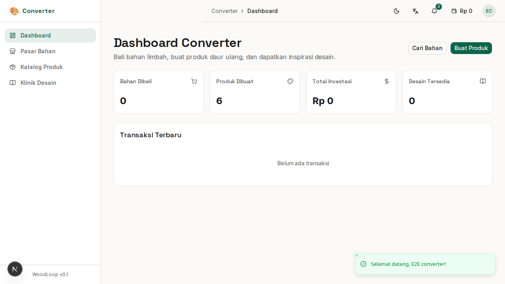

# Bab 7: Panduan Converter (Pengrajin Kreatif)

---

**Converter** adalah pihak yang **mengolah limbah kayu** menjadi produk baru yang bernilai jual (*upcycling*). Converter adalah **inti kreatif** dari ekonomi sirkular — mereka yang mengubah "sampah" menjadi barang bernilai.

**Contoh pengguna Converter:** Pengrajin kreatif, startup daur ulang, desainer produk, workshop inovatif.

---

## 7.1 Dashboard Converter

Setelah login sebagai Converter, halaman pertama adalah **Dashboard Converter**.

*Gambar 7.1 — Dashboard Converter*

### Ringkasan Kartu

| Kartu | Menampilkan |
|-------|-------------|
| 🛒 **Bahan Dibeli** | Total bahan limbah yang sudah dibeli |
| 📦 **Produk Dibuat** | Jumlah produk upcycled yang dibuat |
| 💰 **Total Penjualan** | Pendapatan dari penjualan produk |
| 📊 **CO₂ Tersimpan** | Estimasi dampak lingkungan (kg CO₂) |

---

## 7.2 Pasar Bahan Limbah

**Pasar Bahan** adalah marketplace tempat Converter membeli bahan limbah dari Aggregator.

*Gambar 7.2 — Pasar bahan limbah*

### Fitur Halaman

| Fitur | Fungsi |
|-------|--------|
| 🔍 **Pencarian** | Cari bahan berdasarkan jenis/kata kunci |
| 🪵 **Filter Jenis Kayu** | Tampilkan jenis kayu tertentu |
| 📐 **Filter Bentuk** | Filter: Offcut, Shaving, Sawdust, dll |
| 💰 **Filter Harga** | Range harga minimal - maksimal |
| 🔄 **Reset** | Kembalikan filter ke default |

### Kartu Bahan

Setiap bahan ditampilkan dalam kartu berisi:
- 🖼️ **Foto** bahan
- 🪵 **Jenis kayu** & bentuk limbah
- 📏 **Volume** stok
- 💰 **Harga** per satuan
- 🏪 **Nama Aggregator**
- 🛒 Tombol **"Beli"** atau **"Tambah ke Keranjang"**

### Tips Memilih Bahan

| Kriteria | Saran |
|----------|-------|
| ✅ **Kualitas** | Pilih bahan kering, tidak pecah, tidak berjamur |
| ✅ **Ukuran** | Sesuaikan dengan desain produk yang akan dibuat |
| ✅ **Harga** | Bandingkan harga antar Aggregator |
| ✅ **Jarak** | Prioritaskan Aggregator terdekat (ongkos kirim lebih murah) |

---

## 7.3 Checkout & Pembelian Bahan

Proses pembelian bahan limbah dari Aggregator.

### Langkah Checkout

1. Di Pasar Bahan, klik **"Beli"** pada bahan yang diinginkan
2. Tentukan **jumlah** yang ingin dibeli
3. Review **total harga**
4. Pilih **metode pembayaran**:
   - 💳 **Dompet WoodLoop** — saldo digital
   - 🏦 **Transfer Bank** — manual konfirmasi
5. Klik **"Konfirmasi Pembelian"**
6. Tunggu konfirmasi dari Aggregator

### Status Pembelian

| Status | Arti |
|--------|------|
| ⏳ **Menunggu Konfirmasi** | Aggregator belum merespon |
| ✅ **Dikonfirmasi** | Aggregator setuju, siap kirim |
| 🚚 **Dikirim** | Bahan dalam perjalanan |
| 📦 **Diterima** | Bahan sudah sampai |
| ❌ **Dibatalkan** | Transaksi batal |

---

## 7.4 Klinik Desain (Design Clinic)

Klinik Desain telah dipindahkan ke peran **Desainer**. Converter dapat mengaksesnya melalui menu **"Klinik Desain"** di sidebar yang akan mengarahkan ke `/designer/design-clinic`.

Di sana Anda dapat:
- Menemukan **resep desain** dan inspirasi produk dari limbah kayu
- **Menghubungi desainer** untuk konsultasi produk secara personal
- **Mengajukan permintaan** jasa desain sesuai kebutuhan
- Melihat **catatan desain** yang mungkin sudah diberikan oleh Desainer pada produk Anda

> **💡 Tips:** Sebelum membeli bahan dari Aggregator, cek dulu Klinik Desain untuk melihat kemungkinan produk yang bisa dibuat dari limbah yang tersedia.

---

## 7.5 Membuat Produk Upcycled

Setelah memiliki bahan, Anda bisa mendaftarkan produk upcycled yang sudah dibuat.

### Form Produk Baru

| Field | Wajib | Keterangan |
|-------|:-----:|------------|
| **Nama Produk** | ✅ | "Vas Bunga dari Limbah Jati" |
| **Kategori** | ✅ | Dekorasi, Furniture, Aksesoris |
| **Deskripsi** | ✅ | Cerita tentang produk & bahan |
| **Bahan Baku** | ✅ | Pilih dari pembelian bahan |
| **Harga** | ✅ | Harga jual produk |
| **Stok** | ✅ | Jumlah unit |
| **Foto** | ✅ | Minimal 3 foto dari berbagai sudut |
| **Dimensi** | ❌ | Panjang x Lebar x Tinggi (cm) |
| **Berat** | ❌ | Berat produk (kg) |

> **Tips:** Foto produk yang menarik meningkatkan minat Buyer. Gunakan latar belakang bersih dan pencahayaan alami.

### Menghubungkan dengan Bahan Baku

Saat membuat produk, Anda bisa menghubungkannya dengan **transaksi pembelian bahan** dari Aggregator. Ini penting untuk **QR Traceability** — Buyer bisa melihat asal-usul bahan produk.

---

## 7.6 Katalog Produk Saya

Halaman **Katalog Produk** menampilkan semua produk upcycled yang sudah Anda buat.

*Gambar 7.6 — Katalog produk upcycled*

### Fitur Katalog

| Fitur | Fungsi |
|-------|--------|
| 📋 **Grid/Tabel** | Tampilan grid atau tabel |
| 🔍 **Pencarian** | Cari produk Anda |
| 📝 **Edit** | Ubah data produk |
| 🗑️ **Hapus** | Hapus produk |
| 📊 **Statistik** | Lihat berapa kali produk dilihat |

### Status Produk

| Status | Arti |
|--------|------|
| 🟢 **Aktif** | Produk tampil di marketplace Buyer |
| 🔴 **Tidak Aktif** | Produk disembunyikan |
| ⏳ **Draft** | Belum selesai, masih diedit |

---

## 7.7 QR Code Produk

Setiap produk yang dibuat Converter akan otomatis mendapatkan **QR Code unik**.

### Cara Kerja QR Code

1. ✅ Produk dibuat → sistem generate **QR Code**
2. 🖨️ Cetak QR Code dan tempelkan di produk
3. 📱 Buyer scan QR → lihat halaman traceability
4. 🌍 Halaman traceability **publik** — bisa diakses tanpa login

### Melihat QR Code Produk

1. Buka **Katalog Produk**
2. Klik produk → detail produk
3. Klik ikon **QR Code** (📱)
4. QR Code akan ditampilkan dalam ukuran besar — siap dicetak

### Manfaat QR Code

| Manfaat | Untuk Converter | Untuk Buyer |
|---------|----------------|-------------|
| ✅ **Transparansi** | Bukti bahan legal | Asal-usul produk jelas |
| ✅ **Kepercayaan** | Produk lebih dipercaya | Yakin produk ramah lingkungan |
| ✅ **Branding** | Cerita produk unik | Terhubung dengan pengrajin |
| ✅ **SEO** | Halaman traceability muncul di Google | Mudah cari info produk |

---

### Ringkasan Bab 7

| Fitur | Halaman | Fungsi Utama |
|-------|---------|-------------|
| Dashboard | `/converter/dashboard` | Ringkasan bahan & produk |
| Pasar Bahan | `/converter/marketplace/materials` | Beli limbah dari Aggregator |
| Katalog Produk | `/converter/catalog` | Kelola produk upcycled |
| Klinik Desain | `/designer/design-clinic` | Inspirasi & resep desain (redirect) |
| QR Code | (dari detail produk) | Generate QR untuk traceability |

---
➡️ **Lanjut ke [Bab 8: Panduan Buyer](./08-bab-8-buyer.md)**
