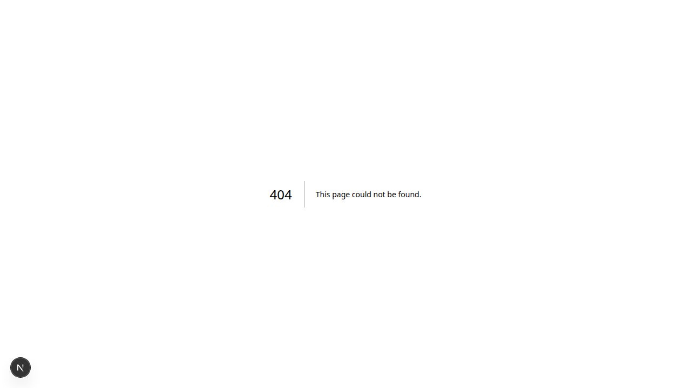

# Bab 8: Panduan Buyer (Konsumen Akhir)

---

**Buyer** adalah konsumen akhir yang membeli produk upcycled dari Converter. Buyer bisa datang dari berbagai latar belakang — individu yang peduli lingkungan, toko retail, atau kolektor produk kayu unik.

**Contoh pengguna Buyer:** Pembeli perorangan, pemilik toko souvenir, desainer interior, kolektor.

---

## 8.1 Marketplace Produk

**Marketplace** adalah halaman utama Buyer — menampilkan semua produk upcycled dari para Converter.


*Gambar 8.1 — Marketplace produk upcycled*

### Fitur Marketplace

| Fitur | Fungsi |
|-------|--------|
| 🔍 **Pencarian** | Cari produk berdasarkan nama atau kata kunci |
| 📂 **Kategori** | Filter: Furniture, Dekorasi, Aksesoris, Mainan |
| 🏷️ **Filter Harga** | Range harga minimal - maksimal |
| 🪵 **Filter Bahan** | Filter berdasarkan jenis kayu |
| 🔄 **Reset** | Kembalikan semua filter |

### Tampilan Produk

Setiap produk ditampilkan dalam kartu berisi:
- 🖼️ **Foto utama** produk
- 📝 **Nama produk**
- 🏪 **Nama Converter** (pengrajin)
- 💰 **Harga**
- 🌱 **Badge** "Eco-Friendly" / "Upcycled"
- ⭐ **Rating** (jika ada)

### Kategori Produk

| Kategori | Contoh Produk |
|----------|---------------|
| 🪑 **Furniture** | Meja, kursi, rak, lemari |
| 🏺 **Dekorasi** | Vas, patung, hiasan dinding |
| 📿 **Aksesoris** | Gelang, kalung, gantungan kunci |
| 🧸 **Mainan** | Puzzle kayu, mainan edukasi |
| 🛠️ **Peralatan** | Talenan, kotak, tempat pensil |

---

## 8.2 Detail Produk & Traceability

Klik pada kartu produk untuk melihat **halaman detail** yang lengkap.

### Informasi Produk

| Field | Keterangan |
|-------|------------|
| **Nama Produk** | Nama produk |
| **Deskripsi** | Cerita tentang produk & proses pembuatan |
| **Bahan** | Jenis limbah kayu yang digunakan |
| **Dimensi** | Ukuran produk |
| **Berat** | Berat produk |
| **Harga** | Harga jual |
| **Stok** | Ketersediaan |

### Cerita Traceability

Bagian **"Cerita Produk"** menampilkan perjalanan produk:

```
🌲 Supplier → 🏭 Generator → 🚛 Aggregator → ♻️ Converter → 🛒 Buyer
```

Setiap tahap menampilkan:
- **Nama** pihak yang terlibat
- **Tanggal** transaksi
- **Lokasi** (kota)
- **Dampak lingkungan** (CO₂ yang terhindarkan)

---

## 8.3 Keranjang Belanja (Cart)

**Keranjang Belanja** menyimpan produk yang ingin Anda beli.


*Gambar 8.3 — Halaman keranjang belanja*

### Fitur Keranjang

| Fitur | Fungsi |
|-------|--------|
| ➕ **Tambah Qty** | Menambah jumlah produk |
| ➖ **Kurang Qty** | Mengurangi jumlah produk |
| 🗑️ **Hapus** | Menghapus item dari keranjang |
| 💰 **Subtotal** | Total harga per item |
| 📊 **Total** | Total seluruh belanjaan |
| 🛒 **Checkout** | Lanjut ke pembayaran |

> **Tips:** Keranjang tersimpan di akun Anda — bisa diakses dari perangkat mana pun selama login.

### Cara Menambahkan ke Keranjang

1. Di halaman detail produk, klik **"Tambah ke Keranjang"**
2. Pilih **jumlah** yang diinginkan
3. Klik **"Simpan"**
4. Ikon keranjang di header akan menunjukkan jumlah item

---

## 8.4 Checkout & Pembayaran

Proses checkout mengubah keranjang menjadi **pesanan**.


*Gambar 8.4 — Halaman checkout*

### Langkah Checkout

1. Buka halaman **Keranjang**
2. Klik **"Checkout"**
3. Isi **Alamat Pengiriman**:

| Field | Wajib | Contoh |
|-------|:-----:|--------|
| Nama Penerima | ✅ | Budi Santoso |
| Nomor Telepon | ✅ | 081234567890 |
| Alamat Lengkap | ✅ | Jl. Sudirman No. 10 |
| Kota/Kabupaten | ✅ | Jepara |
| Kode Pos | ✅ | 59419 |
| Catatan | ❌ | "Mohon dibungkus rapih" |

4. Pilih **Metode Pembayaran**:

| Metode | Biaya | Proses |
|--------|:-----:|--------|
| 💳 **Midtrans** | 0 (flat per transaksi) | Otomatis, realtime |
| 💰 **Dompet WoodLoop** | Gratis | Instan (jika saldo cukup) |
| 🏦 **Transfer Bank** | Gratis | Manual (1×24 jam) |

5. Klik **"Bayar Sekarang"**
6. Ikuti instruksi pembayaran

### Integrasi Midtrans

Jika memilih **Midtrans**:
1. Anda akan diarahkan ke halaman pembayaran Midtrans
2. Pilih metode: **GoPay, OVO, Dana, transfer bank, atau kartu kredit**
3. Selesaikan pembayaran
4. Otomatis kembali ke WoodLoop
5. Status pesanan berubah menjadi **"Dibayar"**

---

## 8.5 Tracking Pesanan

Setelah pembayaran berhasil, Anda bisa melacak status pesanan.


*Gambar 8.5 — Halaman pesanan Buyer*

### Timeline Pesanan

```
⏳ Menunggu Bayar
    ↓ (pembayaran berhasil)
✅ Dibayar — Converter mulai memproses
    ↓ 
🔄 Diproses — Converter sedang membuat/menyiapkan
    ↓
🚚 Dikirim — Pesanan dalam perjalanan (dilengkapi no. resi jika ada)
    ↓
📦 Diterima — Konfirmasi terima dari Buyer
    ↓
⭐️ Selesai — Transaksi selesai, beri rating
```

### Aksi Buyer

| Status | Aksi Buyer |
|--------|-----------|
| ⏳ **Menunggu Bayar** | Bayar sekarang / Batalkan pesanan |
| ✅ **Dibayar** | Tunggu Converter memproses |
| 🚚 **Dikirim** | Lacak pengiriman |
| 📦 **Diterima** | Klik **"Konfirmasi Terima"** |
| ⭐️ **Selesai** | Beri rating & ulasan |

### Membatalkan Pesanan

Pesanan dengan status **"Menunggu Bayar"** bisa dibatalkan sendiri.
Pesanan yang sudah dibayar — hubungi Converter via Chat untuk pembatalan.

---

## 8.6 Scan QR Code Produk

Setiap produk upcycled memiliki **QR Code unik** yang bisa di-scan.

### Cara Scan QR

**Di Aplikasi Android:**
1. Buka aplikasi WoodLoop
2. Tap ikon **QR Scanner** di halaman utama
3. Arahkan kamera ke QR Code produk
4. Otomatis membuka halaman traceability

**Di Web Browser:**
1. Buka `https://woodloop.app`
2. Klik ikon **QR Scanner** (📷)
3. Izinkan browser mengakses kamera
4. Arahkan ke QR Code
5. Atau upload foto QR Code

**Tanpa Aplikasi:**
1. Buka kamera HP
2. Arahkan ke QR Code
3. Klik link yang muncul
4. Otomatis membuka halaman traceability

> **Tips:** QR Code bisa di-scan dengan kamera HP bawaan, tidak perlu aplikasi khusus!

---

### Ringkasan Bab 8

| Fitur | Halaman | Fungsi Utama |
|-------|---------|-------------|
| Marketplace | `/buyer/marketplace` | Jelajahi & cari produk |
| Detail Produk | `/buyer/product/[id]` | Info lengkap & cerita traceability |
| Keranjang | `/buyer/cart` | Kelola belanjaan |
| Checkout | `/buyer/checkout` | Pembayaran (Midtrans) |
| Pesanan | `/buyer/orders` | Lacak status pesanan |
| QR Scan | (scanner) | Scan QR → halaman traceability |

---
➡️ **Lanjut ke [Bab 9: Panduan Enabler](./09-bab-9-enabler.md)**
