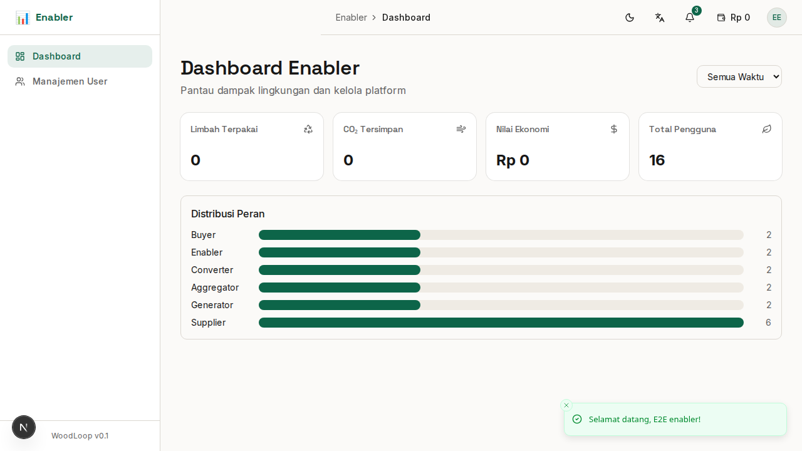
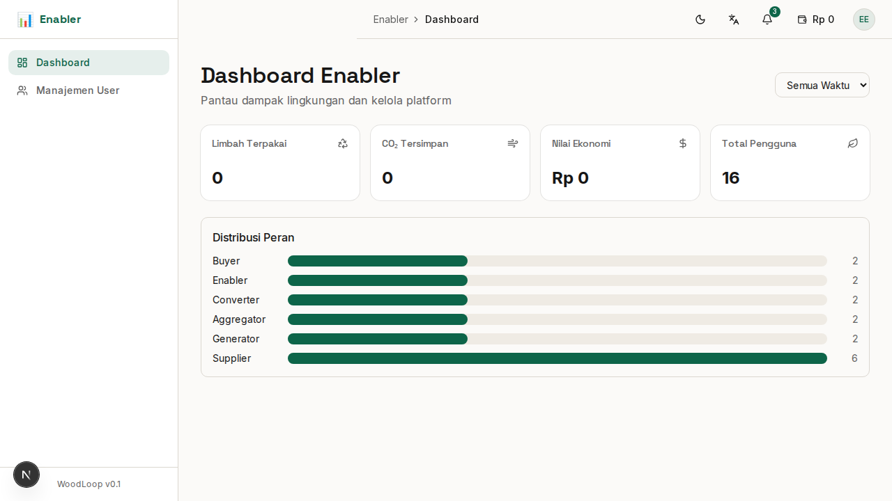

# Bab 10: Panduan Enabler (Pemerintah & Asosiasi)

---

**Enabler** adalah pemantau ekosistem — pihak yang memantau dampak lingkungan dan ekonomi dari kegiatan ekonomi sirkular di WoodLoop. Biasanya berasal dari **pemerintah daerah**, **dinas lingkungan hidup**, atau **asosiasi industri mebel**.

**Contoh pengguna Enabler:** Dinas Lingkungan Hidup Jepara, ASMINDO, Dinas Perindustrian.

---

## 9.1 Dashboard Impact Analytics

Dashboard Enabler menampilkan **data dan grafik dampak** dari seluruh aktivitas di platform WoodLoop.

*Gambar 9.1 — Dashboard impact analytics Enabler*

### Kartu Metrik Utama

| Metrik | Menampilkan | Contoh |
|--------|-------------|--------|
| 🌿 **Limbah Terpakai** | Total limbah yang berhasil dialihkan dari TPA | 15.000 kg |
| 🌍 **CO₂ Tersimpan** | Estimasi emisi karbon yang terhindarkan | 2.500 kg CO₂ |
| 💰 **Nilai Ekonomi** | Total nilai transaksi di ekosistem | Rp 125.000.000 |
| 👥 **Pengguna Aktif** | Jumlah pengguna yang aktif bertransaksi | 250 pengguna |

### Grafik & Chart

| Grafik | Sumbu X | Sumbu Y | Kegunaan |
|--------|---------|---------|----------|
| 📈 **Tren Limbah per Bulan** | Bulan | Volume (kg) | Melihat peningkatan pengelolaan limbah |
| 📊 **Transaksi per Role** | Role (6) | Jumlah transaksi | Membandingkan kontribusi tiap role |
| 🗺️ **Distribusi Geografis** | Kecamatan | Volume limbah | Melihat daerah dengan aktivitas terbanyak |
| ♻️ **Jenis Limbah** | Bentuk limbah (5) | Persentase | Komposisi limbah yang dikelola |

### Filter Data

| Filter | Fungsi |
|--------|--------|
| 📅 **Periode Waktu** | Hari ini, Minggu ini, Bulan ini, Tahun ini, Kustom |
| 🗺️ **Wilayah** | Seluruh Jepara, per kecamatan |
| 👥 **Per Role** | Tampilkan data spesifik per peran |

---

## 9.2 Manajemen Pengguna

Halaman **Manajemen User** memungkinkan Enabler melihat dan mengelola seluruh pengguna WoodLoop.

*Gambar 9.2 — Halaman manajemen pengguna*

### Tabel Pengguna

Tabel menampilkan:

| Kolom | Keterangan |
|-------|------------|
| 👤 **Nama** | Nama lengkap pengguna |
| 📧 **Email** | Email terdaftar |
| 🎭 **Peran** | Supplier, Generator, Aggregator, Converter, Buyer, Enabler |
| 📅 **Bergabung** | Tanggal registrasi |
| ✅ **Verifikasi** | Terverifikasi / Belum |
| 📊 **Status** | Aktif / Nonaktif |
| ⚙️ **Aksi** | Detail, verifikasi, nonaktifkan |

### Fitur Manajemen

| Fitur | Fungsi |
|-------|--------|
| 🔍 **Pencarian** | Cari berdasarkan nama, email, atau peran |
| 🎭 **Filter Peran** | Tampilkan pengguna per role tertentu |
| ✅ **Verifikasi Akun** | Setujui/tolak permintaan verifikasi |
| 🔒 **Nonaktifkan** | Nonaktifkan akun yang melanggar aturan |
| 📤 **Ekspor Data** | Download data pengguna (CSV/Excel) |

### Proses Verifikasi

Ketika pengguna mengajukan verifikasi:

1. Enabler mendapat notifikasi **"Permintaan Verifikasi Baru"**
2. Buka halaman **Manajemen User**
3. Filter: **"Menunggu Verifikasi"**
4. Klik pengguna → lihat **dokumen** yang diupload
5. Periksa **kelengkapan & keaslian** dokumen
6. Pilih:
   - ✅ **Setujui** — akun terverifikasi, badge biru aktif
   - ❌ **Tolak** — kirim alasan penolakan ke pengguna

### Laporan & Ekspor Data

Enabler bisa mengekspor data untuk pelaporan:

| Jenis Laporan | Format | Kegunaan |
|---------------|--------|----------|
| 📊 **Data Transaksi** | CSV, Excel | Laporan ekonomi sirkular |
| 👥 **Data Pengguna** | CSV | Database peserta program |
| 🌿 **Data Limbah** | CSV | Laporan pengelolaan limbah |
| 🌍 **Data Dampak** | CSV, PDF | Laporan keberlanjutan |

---

### Ringkasan Bab 10

| Fitur | Halaman | Fungsi Utama |
|-------|---------|-------------|
| Dashboard | `/enabler/dashboard` | Grafik & metrik dampak |
| Manajemen User | `/enabler/users` | Kelola & verifikasi pengguna |
| Ekspor Data | (dari tabel) | Download laporan CSV/Excel |

---
➡️ **Lanjut ke [Bab 11: Fitur Global](./11-bab-11-fitur-global.md)**
