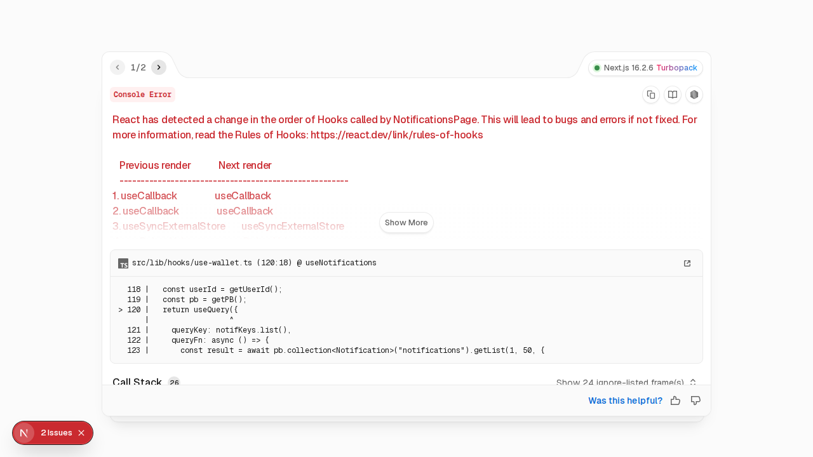

# Bab 11: Fitur Global (Semua Peran)

---

Fitur global adalah fitur yang bisa diakses oleh **semua peran** pengguna WoodLoop.

---

## 11.1 Dompet Digital

Setiap pengguna WoodLoop memiliki **dompet digital** untuk transaksi keuangan di dalam platform.

*Gambar 11.1 — Halaman dompet digital*

| Informasi | Keterangan |
|-----------|------------|
| **Saldo** | Jumlah saldo saat ini |
| **Total Pemasukan** | Total uang yang masuk |
| **Total Pengeluaran** | Total uang yang keluar |
| **Riwayat** | Daftar transaksi (filterable) |

**Cara Mendapatkan Saldo:**

| Peran | Cara Mendapatkan Saldo |
|-------|----------------------|
| **Supplier** | Kayu terjual ke Generator |
| **Generator** | Limbah dibeli Aggregator |
| **Aggregator** | Stok gudang dibeli Converter |
| **Converter** | Produk terjual ke Buyer |
| **Buyer** | Top-up saldo (via transfer) |

---

## 11.2 Pusat Notifikasi

*Gambar 11.2 — Halaman pusat notifikasi*

| Fitur | Fungsi |
|-------|--------|
| **Ikon Notif** | Angka merah di header → jumlah notif belum dibaca |
| **Daftar** | Semua notifikasi terurut (terbaru di atas) |
| **Tandai Semua Dibaca** | Satu klik untuk semua notifikasi |
| **Hapus** | Hapus notifikasi yang tidak diperlukan |

Di aplikasi Android, notifikasi juga muncul sebagai **push notification** meskipun aplikasi sedang tertutup.

---

## 11.3 Pesan & Chat

**Fitur Chat** memungkinkan pengguna berkomunikasi secara realtime.

*Gambar 11.3 — Halaman chat*

| Fitur | Fungsi |
|-------|--------|
| **Daftar Chat** | Semua percakapan terurut (terbaru di atas) |
| **Pesan Real-time** | WebSocket — pesan langsung terkirim & diterima |
| **Kirim Gambar** | Upload foto (contoh: foto kondisi kayu) |
| **Search Chat** | Cari pesan tertentu |

**Siapa Bisa Chat dengan Siapa?**

| Pengirim | Penerima | Keperluan |
|----------|----------|-----------|
| Generator | Aggregator | Negosiasi harga & jadwal pickup |
| Aggregator | Generator | Konfirmasi pickup, tanya lokasi |
| Converter | Aggregator | Tanya spesifikasi bahan |
| Buyer | Converter | Tanya produk, negosiasi |
| Supplier | Generator | Konfirmasi pengiriman kayu |

---

## 11.4 Dokumen Legalitas

Setiap pengguna bisa mengupload dokumen legalitas untuk **verifikasi akun** atau keperluan bisnis.

| Dokumen | Format | Maks Ukuran |
|---------|--------|-------------|
| KTP | JPG, PNG | 2 MB |
| SIUP / NIB | PDF, JPG, PNG | 5 MB |
| SVLK / FSC Certificate | PDF | 5 MB |
| NPWP | PDF, JPG | 2 MB |

**Cara upload:**
1. Buka halaman **Profil**
2. Scroll ke **"Dokumen Legalitas"**
3. Klik **"Tambah Dokumen"**
4. Pilih jenis dokumen → upload file → **"Simpan"**

> Dokumen hanya bisa dilihat oleh pemilik akun dan admin Enabler.

---

## 11.5 Profil B2B

Setiap pengguna (kecuali Buyer biasa) memiliki **profil bisnis** publik.

| Informasi | Supplier | Generator | Aggregator | Converter | Enabler |
|-----------|:--------:|:---------:|:----------:|:---------:|:-------:|
| Nama Usaha | ✅ | ✅ | ✅ | ✅ | ✅ |
| Alamat | ✅ | ✅ | ✅ | ✅ | ✅ |
| Nomor Telepon | ✅ | ✅ | ✅ | ✅ | ✅ |
| Sertifikasi | ✅ | ✅ | — | ✅ | — |

Klik **nama pengguna** di kartu produk/pesanan untuk melihat profil B2B.

---
➡️ **Lanjut ke [Bab 12: Traceability & QR Code](./12-bab-12-traceability.md)**
