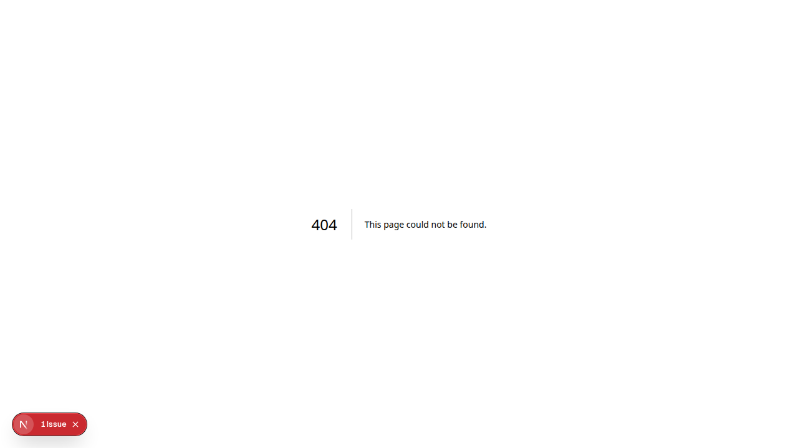

# Bab 12: Traceability & QR Code

---

**Traceability** (ketertelusuran) adalah fitur unggulan WoodLoop yang memungkinkan setiap produk upcycled **dilacak asal-usulnya** melalui QR Code unik.

---

## 12.1 Apa Itu QR Traceability?

Setiap produk yang dibuat oleh Converter mendapatkan **QR Code unik** yang menyimpan seluruh **cerita perjalanan produk**:

```
🌲 Supplier → 🏭 Generator → 🚛 Aggregator → ♻️ Converter → 🛒 Buyer
```

Ketika QR Code di-scan, Buyer bisa melihat:

| Informasi | Detail |
|-----------|--------|
| **Jenis Kayu Asli** | Jati, Mahoni, Sono Keling, dll |
| **Supplier Asal** | Nama & lokasi pemasok kayu |
| **Generator** | Pengrajin yang menghasilkan limbah |
| **Aggregator** | Pengepul yang menyortir & menyimpan |
| **Converter** | Pengrajin yang membuat produk |
| **Dampak Lingkungan** | CO₂ tersimpan, limbah teralihkan |
| **Timeline** | Tanggal setiap tahap perjalanan |

**Manfaat:**

| Untuk Siapa | Manfaat |
|-------------|---------|
| **Buyer** | Yakin produk asli, ramah lingkungan, dan legal |
| **Converter** | Nilai jual produk lebih tinggi, branding cerita unik |
| **Enabler** | Data dampak lingkungan & ekonomi terverifikasi |

---

## 12.2 Cara Scan QR Code

| Metode | Cara |
|--------|------|
| **Kamera HP** | Arahkan kamera ke QR Code → tap notifikasi link yang muncul |
| **Aplikasi Android** | Buka WoodLoop → tap QR Scanner → arahkan kamera |
| **Upload Foto (Web)** | Buka `woodloop.app` → klik QR Scanner → **"Upload Foto QR"** |

> Tidak perlu install aplikasi apapun. Kamera HP modern sudah bisa membaca QR Code secara native.

**Format QR Code:** Minimal 2×2 cm, hitam di atas putih, link ke `https://woodloop.app/p/[qr_code_id]`.

---

## 12.3 Halaman Traceability Publik

Halaman traceability adalah halaman **publik** yang bisa diakses siapa saja **tanpa login**.


*Gambar 12.1 — Halaman traceability publik*

| Bagian | Konten |
|--------|--------|
| **Foto Produk** | Gambar utama produk |
| **Nama & Deskripsi** | Informasi dasar produk |
| **Dampak Lingkungan** | Badge: CO₂ saved, waste diverted |
| **Timeline** | Perjalanan produk dari Supplier → Buyer |
| **Profil Pengrajin** | Informasi Converter pembuat |

Halaman traceability adalah **Server-Side Rendered (SSR)** — muncul di hasil pencarian Google dan bisa diindex oleh search engine.

---

## 12.4 Dampak Lingkungan

| Metrik | Satuan | Arti |
|--------|--------|------|
| **Limbah Teralihkan** | kg | Jumlah limbah yang tidak dibakar/dibuang |
| **CO₂ Tersimpan** | kg CO₂ | Emisi karbon yang terhindarkan |
| **Energi Terhemat** | kWh | Energi yang tidak terpakai |
| **Air Terhemat** | liter | Air yang tidak terpakai |

**Badge Dampak** ditampilkan pada setiap produk yang memiliki data rantai pasok lengkap.

---
➡️ **Lanjut ke [Bab 13: Troubleshooting & FAQ](./13-bab-13-troubleshooting.md)**
