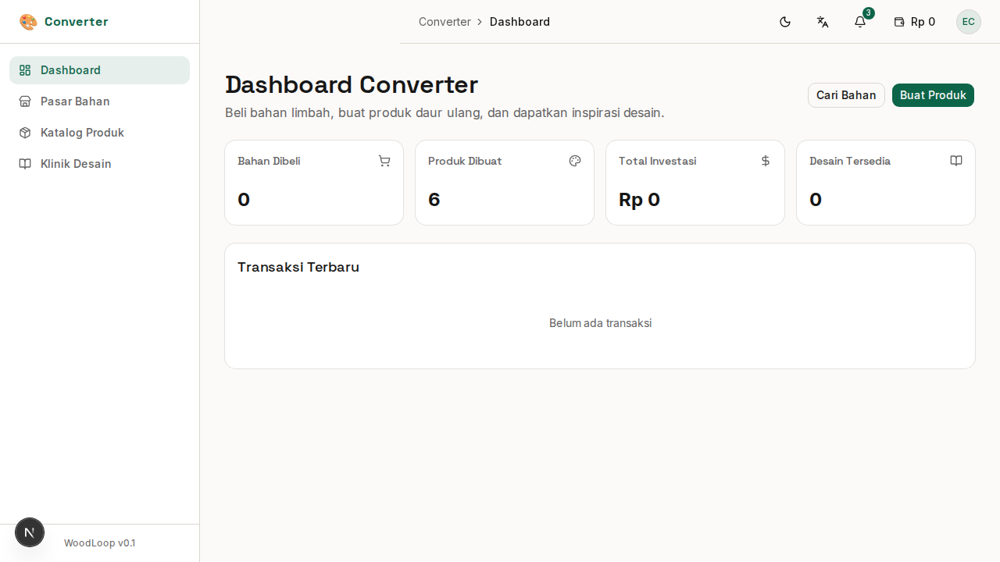

# Bab 9: Klinik Desain

---

**Klinik Desain** adalah pusat inspirasi yang berisi resep desain (*design recipes*) untuk membantu Converter mendapatkan ide produk baru dari bahan limbah.

*Gambar 9.1 — Halaman Klinik Desain*

---

## 9.1 Inspirasi Desain

Klinik Desain menampilkan koleksi **resep desain** yang dibuat oleh Admin/Desainer. Setiap resep berisi panduan lengkap untuk membuat produk tertentu dari limbah kayu.

| Informasi | Keterangan |
|-----------|------------|
| **Judul** | Nama resep desain |
| **Jenis Kayu yang Cocok** | Rekomendasi jenis kayu terbaik untuk resep ini |
| **Tingkat Kesulitan** | 🟢 Mudah / 🟡 Sedang / 🔴 Sulit |
| **Deskripsi** | Penjelasan dan panduan pembuatan |
| **Penulis** | Admin atau Desainer yang membuat resep |

---

## 9.2 Filter Resep Desain

Klinik Desain menyediakan filter untuk memudahkan pencarian:

| Fitur | Fungsi |
|-------|--------|
| 🔍 **Pencarian** | Cari resep berdasarkan judul atau deskripsi |
| **Filter Tingkat Kesulitan** | Tampilkan resep berdasarkan tingkat kesulitan (Mudah, Sedang, Sulit) |
| **Filter Jenis Kayu** | Filter berdasarkan jenis kayu yang cocok |

> **📝 Catatan:** Klinik Desain adalah fitur bersama antara Converter dan peran lainnya. Resep dikelola oleh Admin dan Desainer. Jika Anda memiliki ide desain yang ingin dibagikan, hubungi Admin WoodLoop.

---
➡️ **Lanjut ke [Bab 10: Troubleshooting](./10-bab-10-troubleshooting.md)**
