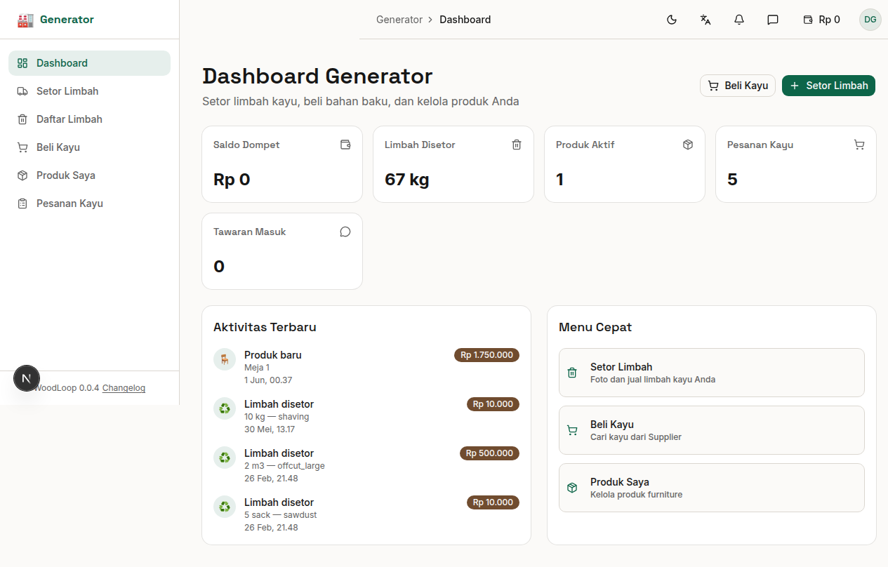

# Bab 3: Dashboard Generator

---

Dashboard Generator adalah halaman utama yang muncul setelah login. Di sini Anda dapat melihat ringkasan bisnis secara sekilas.

*Gambar 3.1 — Dashboard Generator*

---

## 3.1 Ringkasan Kartu (Summary Cards)

| Kartu | Ikon | Menampilkan |
|-------|------|-------------|
| **Saldo Dompet** | 👛 | Saldo dari penjualan limbah yang sudah dijemput |
| **Limbah Disetor** | 🗑️ | Total limbah yang sudah disetorkan |
| **Produk Aktif** | 📦 | Jumlah produk generator yang aktif |
| **Tawaran Masuk** | 📨 | Jumlah penawaran (bidding) dari Aggregator |

Data pada kartu ini diperbarui secara otomatis setiap kali halaman dimuat.

---

## 3.2 Aktivitas Terbaru

Di bagian bawah dashboard, terdapat daftar **aktivitas terbaru** yang menampilkan riwayat transaksi dan kejadian penting, seperti:

- ✅ **Limbah disetor** — "Anda menyetor limbah Jati — Offcut Besar"
- 📨 **Tawaran masuk** — "Aggregator menawar limbah Anda sebesar Rp50.000"
- 🚚 **Pickup dijadwalkan** — "Pickup limbah dijadwalkan besok"
- 💰 **Pembayaran diterima** — "Saldo dompet bertambah Rp100.000"
- 🪵 **Pesanan kayu** — "Pesanan kayu dari Supplier sedang diproses"

---

## 3.3 Menu Cepat (Quick Actions)

Tombol aksi cepat untuk memulai aktivitas utama:

| Tombol | Fungsi | Tujuan |
|--------|--------|--------|
| 🗑️ **Setor Limbah** | Membuka form setor limbah | `/generator/report-waste` |
| 🪵 **Beli Kayu** | Membuka marketplace kayu | `/generator/buy-timber` |
| 📦 **Produk Saya** | Mengelola produk furnitur | `/generator/products` |

> ⚡ **Catatan:** Tombol **"Setor Limbah"** juga tersedia sebagai link di kartu dengan deskripsi "Foto dan jual limbah kayu Anda".

---
➡️ **Lanjut ke [Bab 4: Setor Limbah](./04-bab-4-setor-limbah.md)**
