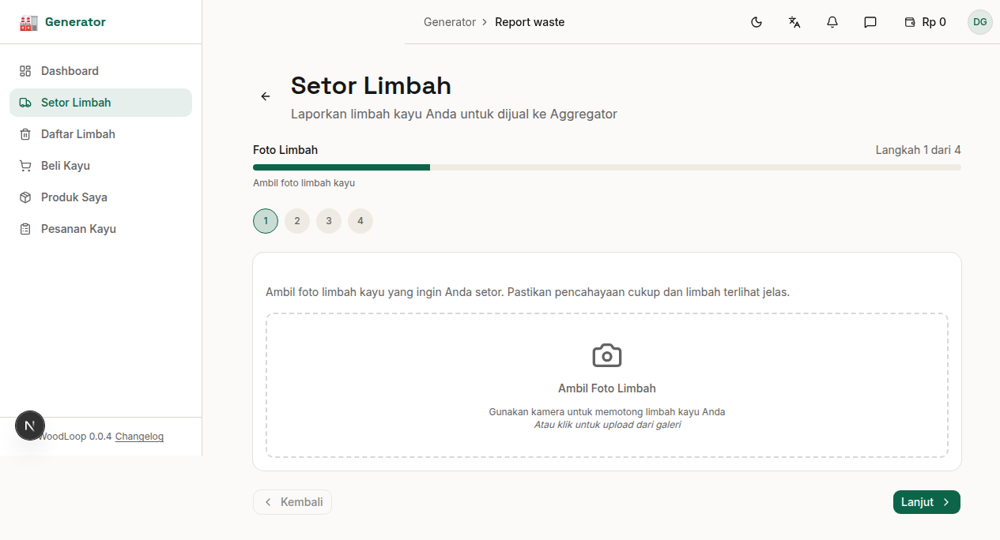

# Bab 4: Setor Limbah

---

Fitur **Setor Limbah** adalah fitur utama Generator — melaporkan limbah kayu yang ingin dijual ke Aggregator. Prosesnya terdiri dari **4 langkah** dalam satu formulir berurutan.


*Gambar 4.1 — Halaman Setor Limbah — Langkah 1*

---

## 4.1 Mengakses Halaman Setor Limbah

| Metode | Cara |
|--------|------|
| **Sidebar** | Klik menu **"Setor Limbah"** di sidebar navigasi |
| **Dashboard** | Klik tombol **"Setor Limbah"** pada menu cepat |
| **Daftar Limbah** | Klik tombol **"Setor Limbah Baru"** |

---

## 4.2 Langkah 1: Foto Limbah

| Ketentuan | Detail |
|-----------|--------|
| Minimal foto | **1 foto** |
| Maksimal foto | **5 foto** |
| Format | JPG, PNG, WebP |
| Ukuran maks. | 5 MB per file |

**Cara:**
1. Klik area **"Ambil Foto Limbah"** — kamera akan terbuka di perangkat mobile, atau file dialog di desktop
2. Ambil foto dari beberapa sudut untuk hasil terbaik
3. Foto akan muncul sebagai thumbnail pratinjau
4. Klik **"Lanjut"** untuk ke langkah berikutnya

> **💡 Tips:** Ambil foto dengan pencahayaan yang cukup agar Aggregator bisa melihat kondisi limbah dengan jelas.

---

## 4.3 Langkah 2: Jenis & Bentuk Limbah

| Field | Tipe Input | Keterangan |
|-------|-----------|------------|
| **Jenis Kayu** | Dropdown | Pilih jenis kayu (Jati, Mahoni, Trembesi, dll) |
| **Bentuk Limbah** | Pilihan grid | Offcut besar/kecil, Shaving, Sawdust, Logs end |
| **Kondisi** | Dropdown | Kering, Basah, Berminyak, Campuran |

> **💡 Tips:** Pilih jenis dan bentuk limbah dengan tepat agar Aggregator dapat menawar dengan harga yang sesuai.

---

## 4.4 Langkah 3: Volume & Harga

| Field | Tipe Input | Contoh |
|-------|-----------|--------|
| **Volume** | Angka | 50 |
| **Satuan** | Dropdown | kg, m³, karung (sack), pickup |
| **Estimasi Harga** | Angka (Rp) | 50000 |
| **Deskripsi** | Textarea | Limbah potongan kursi, ukuran 10-20cm |

**Satuan yang tersedia:**

| Satuan | Penggunaan |
|--------|------------|
| **kg** | Untuk limbah ringan (offcut kecil, serutan) |
| **m³** | Untuk limbah dalam volume besar |
| **sack** | Untuk limbah dalam karungan (serbuk gergaji) |
| **pickup** | Untuk limbah dalam muatan pick-up |

---

## 4.5 Langkah 4: Konfirmasi

Pada langkah terakhir, Anda akan melihat ringkasan data yang sudah diisi:

1. **Preview foto** — Thumbnail foto yang sudah diupload
2. **Detail limbah** — Jenis kayu, bentuk, kondisi
3. **Volume & harga** — Estimasi harga yang diminta
4. Klik **"Setor Limbah"** untuk mengirim

> ✅ **Berhasil!** Limbah Anda akan muncul di **Daftar Limbah** dengan status **"Tersedia"** dan bisa dilihat oleh Aggregator.

### Progress Bar

Setiap langkah ditandai dengan indikator progres:

```
Langkah 1: [████████░░░░] 25% — Foto Limbah
Langkah 2: [████████████░░] 50% — Jenis & Bentuk
Langkah 3: [██████████████░░] 75% — Volume & Harga
Langkah 4: [████████████████] 100% — Konfirmasi
```

---

## 4.6 Jenis & Bentuk Limbah

WoodLoop mengklasifikasikan limbah kayu ke dalam kategori berikut:

| Bentuk Limbah | Ilustrasi | Contoh Penggunaan |
|---------------|-----------|-------------------|
| 🪵 **Offcut Besar** | Potongan kayu > 30cm | Bisa diolah jadi produk kecil |
| 🔲 **Offcut Kecil** | Potongan kayu < 30cm | Cocok untuk sambungan, inlay |
| 🪶 **Shaving** | Serutan tipis | Bahan baku particle board, kompos |
| 🌫️ **Sawdust** | Serbuk gergaji | Bahan baku briket, jamur |
| 🪓 **Logs End** | Ujung kayu gelondongan | Bisa diolah jadi ukiran kecil |

| Kondisi | Arti |
|---------|------|
| ☀️ **Kering** | Kadar air rendah, siap pakai |
| 💧 **Basah** | Baru dipotong, kadar air tinggi |
| 🛢️ **Berminyak** | Mengandung minyak kayu alami |
| 🔀 **Campuran** | Berbagai jenis/kondisi dalam satu lot |

---
➡️ **Lanjut ke [Bab 5: Daftar Limbah](./05-bab-5-daftar-limbah.md)**
