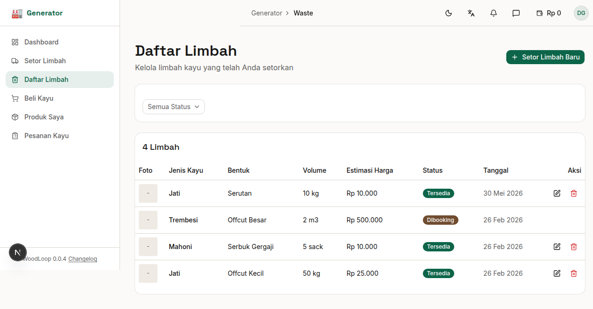

# Bab 5: Daftar Limbah

---

Halaman **Daftar Limbah** menampilkan seluruh limbah yang sudah Anda setorkan, lengkap dengan status dan aksi pengelolaan.


*Gambar 5.1 — Halaman Daftar Limbah*

---

## 5.1 Melihat Daftar Limbah

| Kolom | Keterangan |
|-------|------------|
| **Foto** | Thumbnail foto utama limbah |
| **Jenis Kayu** | Nama jenis kayu (Jati, Mahoni, dll) |
| **Bentuk** | Bentuk limbah (Offcut, Shaving, dll) |
| **Volume** | Jumlah dengan satuan |
| **Estimasi Harga** | Harga yang diharapkan |
| **Status** | Status ketersediaan limbah |
| **Tanggal** | Tanggal disetorkan |
| **Aksi** | Tombol edit / tindakan lainnya |

---

## 5.2 Filter Status

Gunakan dropdown **filter status** untuk menyaring limbah berdasarkan status:

| Filter | Hasil |
|--------|-------|
| **Semua Status** | Menampilkan seluruh limbah |
| **Tersedia** | Limbah yang masih menunggu penawaran |
| **Dibooking** | Limbah yang sudah ditawar dan menunggu penjemputan |
| **Terjual** | Limbah yang sudah dijemput |
| **Terkumpul** | Sinonim dari terjual |

---

## 5.3 Status Limbah

Setiap limbah memiliki status yang mencerminkan posisinya dalam alur jual-beli:

| Status | Badge | Arti |
|--------|-------|------|
| 🟢 **Tersedia** | Hijau | Limbah siap ditawar Aggregator |
| 🔵 **Dibooking** | Biru | Ada Aggregator yang menawar dan menunggu pickup |
| ⚫ **Terjual / Terkumpul** | Abu-abu | Limbah sudah dijemput Aggregator |

**Alur status limbah:**

```
Tersedia → Dibooking → Terjual/Terkumpul
```

---

## 5.4 Edit Limbah

Untuk mengubah data limbah yang masih berstatus **"Tersedia"**:

1. Klik ikon **pensil** (✏️) pada baris limbah yang ingin diedit
2. Anda akan diarahkan ke halaman edit
3. Ubah field yang diperlukan:

| Field | Bisa diubah |
|-------|:-----------:|
| Jenis Kayu | ✅ |
| Bentuk Limbah | ✅ |
| Kondisi | ✅ |
| Volume | ✅ |
| Satuan | ✅ |
| Estimasi Harga | ✅ |
| Foto | ✅ (tambah/hapus) |
| Deskripsi | ✅ |

4. Klik **"Simpan"** untuk menyimpan perubahan

> ⚠️ Limbah dengan status **"Dibooking"** atau **"Terjual"** tidak dapat diedit karena sudah dalam proses transaksi.

---

## 5.5 Hapus Limbah

Untuk menghapus limbah:

1. Klik ikon **tong sampah** (🗑️) pada baris limbah
2. Konfirmasi dialog penghapusan yang muncul:

```
┌──────────────────────────────────────┐
│ Hapus Limbah                          │
│ Apakah Anda yakin ingin menghapus     │
│ limbah ini?                           │
│                                       │
│        [Batal]    [Hapus]             │
└──────────────────────────────────────┘
```

3. Klik **"Hapus"** untuk mengonfirmasi

> ⚠️ **Peringatan:** Hanya limbah dengan status **"Tersedia"** yang bisa dihapus. Penghapusan bersifat permanen.

---

## 5.6 Penawaran dari Aggregator

Setelah limbah disetor dengan status **"Tersedia"**, Aggregator dapat melihat dan mengirimkan penawaran (bid). Anda dapat:

- Melihat jumlah penawaran masuk di **Dashboard** (kartu "Tawaran Masuk")
- Menerima atau menolak penawaran
- Jika Anda menerima penawaran:
  - Status limbah berubah menjadi **"Dibooking"**
  - Pickup otomatis dijadwalkan untuk keesokan hari
  - Aggregator mendapat notifikasi
  - Penawaran lain otomatis ditolak
- Saat Aggregator menyelesaikan pickup:
  - Status limbah → **"Terjual"**
  - Saldo dompet Anda bertambah
  - Anda mendapat notifikasi "Limbah Berhasil Dijemput!"

---
➡️ **Lanjut ke [Bab 6: Beli Kayu Mentah](./06-bab-6-beli-kayu.md)**
