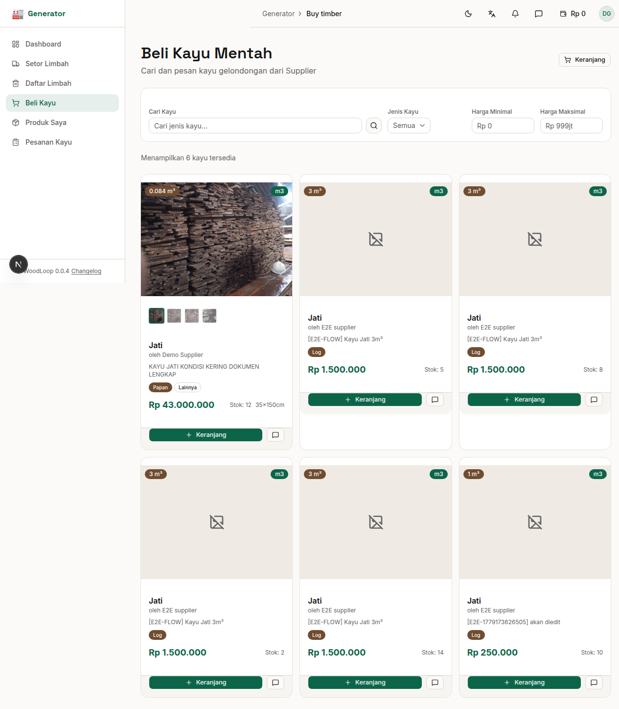

# Bab 6: Beli Kayu Mentah

---

Generator dapat **membeli kayu mentah (raw timber)** dari Supplier untuk bahan baku produksi melalui halaman marketplace.


*Gambar 6.1 — Halaman Beli Kayu Mentah*

---

## 6.1 Marketplace Kayu

Halaman **Beli Kayu** menampilkan semua listing kayu mentah yang tersedia dari para Supplier. Setiap kayu ditampilkan dalam bentuk **kartu** berisi informasi lengkap.

| Info pada Kartu | Keterangan |
|-----------------|------------|
| 🖼️ **Foto** | Gambar utama kayu |
| 🪵 **Jenis Kayu** | Nama jenis kayu (Jati, Mahoni, dll) |
| 📏 **Volume** | Ukuran dalam m³ |
| 💰 **Harga** | Harga per m³ atau total |
| 👤 **Supplier** | Nama pemasok kayu |
| ✅ **Tombol** | "Pesan Sekarang" atau tambah ke keranjang |

---

## 6.2 Filter & Pencarian

Gunakan filter untuk menemukan kayu yang sesuai:

| Fitur | Fungsi |
|-------|--------|
| 🔍 **Pencarian** | Cari kayu berdasarkan jenis atau kata kunci |
| 🪵 **Filter Jenis Kayu** | Tampilkan hanya jenis kayu tertentu |
| 💰 **Filter Harga** | Tentukan range harga (minimal — maksimal) |
| 🔄 **Reset Filter** | Kembalikan semua filter ke default |

---

## 6.3 Kartu Kayu

Setiap kartu kayu menampilkan:

```
┌────────────────────────────────────┐
│ [Foto Kayu]                         │
│                                     │
│ 🪵 Jati                             │
│ 📏 2.5 m³                           │
│ 💰 Rp 5.000.000                     │
│ 👤 Supplier: CV Kayu Jati Abadi     │
│                                     │
│     [Pesan Sekarang]  [💬 Chat]     │
└────────────────────────────────────┘
```

---

## 6.4 Memesan Kayu

Ada dua cara memesan kayu:

### Cara 1: Pesan Langsung
1. Klik tombol **"Pesan Sekarang"** pada kartu kayu
2. Masukkan jumlah yang diinginkan
3. Kayu langsung masuk ke keranjang

### Cara 2: Tambah ke Keranjang
1. Klik tombol keranjang pada kartu kayu
2. Lanjutkan browsing dan tambah kayu lain
3. Buka halaman **Keranjang** untuk checkout

### Chat dengan Supplier
Klik tombol **💬 Chat** untuk menghubungi Supplier jika ada pertanyaan sebelum memesan.

---
➡️ **Lanjut ke [Bab 7: Keranjang & Checkout](./07-bab-7-keranjang-checkout.md)**
