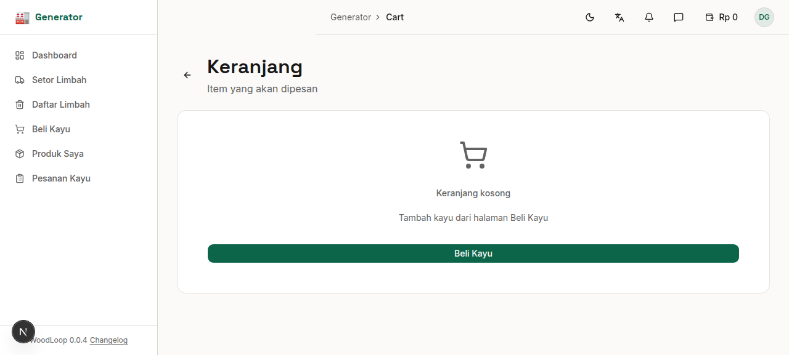
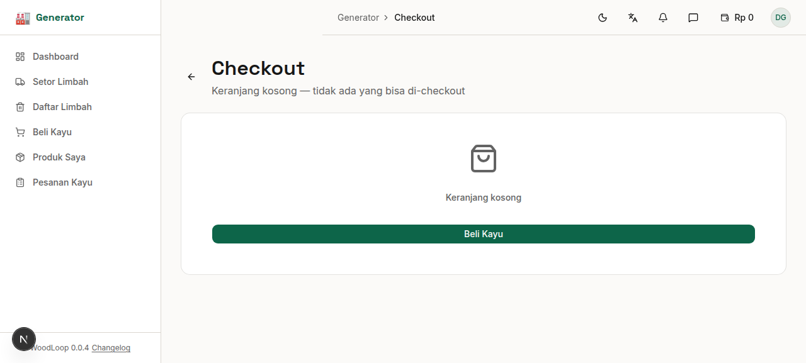
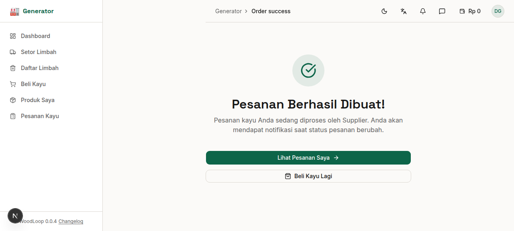

# Bab 7: Keranjang & Checkout

---

Setelah memilih kayu dari marketplace, Anda dapat mengelola pesanan di halaman **Keranjang** sebelum melanjutkan ke **Checkout**.

---

## 7.1 Keranjang Belanja

Halaman keranjang menampilkan semua item yang sudah Anda tambahkan, dikelompokkan berdasarkan Supplier.

*Gambar 7.1 — Halaman Keranjang Belanja*

| Informasi | Detail |
|-----------|--------|
| **Supplier** | Nama Supplier untuk setiap grup |
| **Item** | Jenis kayu, volume, harga per item |
| **Subtotal** | Total per Supplier |
| **Grand Total** | Total seluruh pesanan |

---

## 7.2 Mengelola Item Keranjang

| Aksi | Cara |
|------|------|
| **Tambah jumlah** | Klik tombol **+** pada item |
| **Kurangi jumlah** | Klik tombol **-** pada item |
| **Hapus item** | Klik ikon **tong sampah** pada item |
| **Kosongkan keranjang** | Klik tombol **"Kosongkan"** |

> 💡 Data keranjang disimpan secara lokal di browser Anda, sehingga tetap tersimpan meskipun Anda menutup halaman.

---

## 7.3 Checkout

Setelah puas dengan pilihan, klik tombol **"Checkout"** untuk melanjutkan.

*Gambar 7.2 — Halaman Checkout*

Pada halaman checkout:

1. **Review pesanan** — Periksa kembali item yang dipesan, dikelompokkan per Supplier
2. **Total harga** — Pastikan jumlah total sudah sesuai
3. Klik **"Buat Pesanan"** untuk mengonfirmasi

**Proses di backend:**
Saat Anda membuat pesanan, sistem akan:
- Membuat pesanan induk (*raw_timber_orders*) untuk setiap Supplier
- Membuat detail pesanan (*raw_timber_order_details*) untuk setiap item
- **Memvalidasi harga** dari sisi server (keamanan)
- **Mengurangi stok** kayu Supplier
- **Memberi notifikasi** ke Supplier

> 🛡️ **Keamanan:** Harga divalidasi ulang di server untuk mencegah manipulasi harga dari sisi klien.

---

## 7.4 Halaman Sukses

Setelah checkout berhasil, Anda akan diarahkan ke halaman sukses yang menampilkan:

*Gambar 7.3 — Halaman Sukses Pesanan*

- ✅ **Pesan sukses** — Konfirmasi bahwa pesanan berhasil dibuat
- **ID Pesanan** — Nomor referensi untuk setiap pesanan
- **Total tagihan** — Jumlah yang harus dibayar
- Tombol **"Lihat Pesanan Saya"** — Untuk melanjutkan ke halaman Pesanan Kayu

---
➡️ **Lanjut ke [Bab 8: Pesanan Kayu](./08-bab-8-pesanan-kayu.md)**
