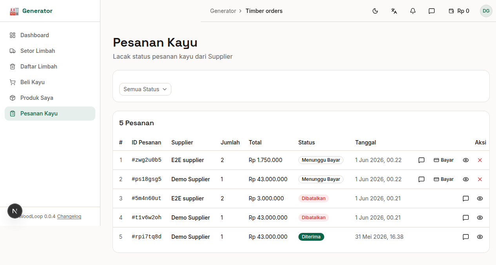

# Bab 8: Pesanan Kayu

---

Halaman **Pesanan Kayu** menampilkan semua pesanan pembelian kayu yang Anda buat ke Supplier, lengkap dengan status dan aksi pembayaran.


*Gambar 8.1 — Halaman Pesanan Kayu*

---

## 8.1 Daftar Pesanan

| Kolom | Keterangan |
|-------|------------|
| **ID Pesanan** | Nomor unik pesanan |
| **Supplier** | Nama pemasok kayu |
| **Total** | Jumlah tagihan |
| **Status** | Status pemrosesan |
| **Tanggal** | Tanggal pemesanan |
| **Aksi** | Tombol bayar, detail, atau batal |

---

## 8.2 Status Pesanan

Setiap pesanan memiliki status yang mencerminkan progres pengiriman:

| Status | Badge | Arti |
|--------|-------|------|
| ⏳ **Menunggu Pembayaran** | Kuning | Pesanan dibuat, menunggu pembayaran via Midtrans |
| 💳 **Dibayar** | Biru | Pembayaran berhasil, Supplier akan memproses |
| 🔄 **Diproses** | Biru | Supplier sedang memproses pesanan |
| 🚚 **Dikirim** | Ungu | Kayu sedang dalam pengiriman |
| 📦 **Diterima** | Hijau | Kayu sudah sampai ke Generator |
| ❌ **Dibatalkan** | Merah | Pesanan dibatalkan |

**Alur status pesanan:**

```
Menunggu Pembayaran → Dibayar → Diproses → Dikirim → Diterima
         ↓
    Dibatalkan
```

> ⚠️ **Notifikasi:** Anda akan mendapat notifikasi saat status pesanan berubah menjadi **"Diproses"**, **"Dikirim"**, atau **"Dibatalkan"**.

---

## 8.3 Pembayaran via Midtrans

WoodLoop menggunakan **Midtrans Snap** sebagai gerbang pembayaran.

**Langkah pembayaran:**

1. Pada halaman Pesanan Kayu, klik tombol **"Bayar"** pada pesanan dengan status **"Menunggu Pembayaran"**
2. Dialog Midtrans Snap akan terbuka
3. Pilih metode pembayaran:

| Metode | Contoh |
|--------|--------|
| 🏦 **Transfer Bank** | BCA, Mandiri, BNI, BRI |
| 💳 **Kartu Kredit/Debit** | Visa, Mastercard |
| 🏧 **ATM / Internet Banking** | Semua bank |
| 📱 **E-Wallet** | GoPay, OVO, Dana, LinkAja |
| 🏪 **Convenience Store** | Indomaret, Alfamaret |

4. Ikuti instruksi pembayaran yang muncul
5. Setelah pembayaran berhasil, status akan berubah menjadi **"Dibayar"**

> 🔑 **Snap Token & Redirect URL:** Sistem secara otomatis membuat snap_token dan snap_redirect_url untuk setiap pesanan yang memerlukan pembayaran.

---

## 8.4 Membatalkan Pesanan

Pesanan dengan status **"Menunggu Pembayaran"** bisa dibatalkan:

1. Klik tombol **"Batal"** pada baris pesanan
2. Konfirmasi di dialog yang muncul
3. Pesanan akan berubah status menjadi **"Dibatalkan"**

> ⚠️ Pesanan dengan status **"Dibayar"** atau selanjutnya **tidak bisa dibatalkan** melalui sistem. Hubungi Supplier langsung untuk pengaturan lebih lanjut.

---
➡️ **Lanjut ke [Bab 9: Produk Saya](./09-bab-9-produk-saya.md)**
