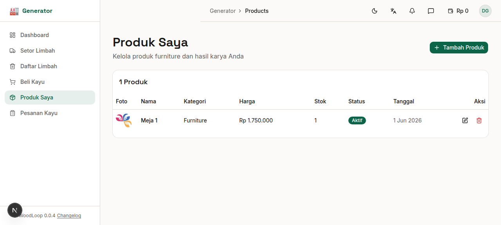
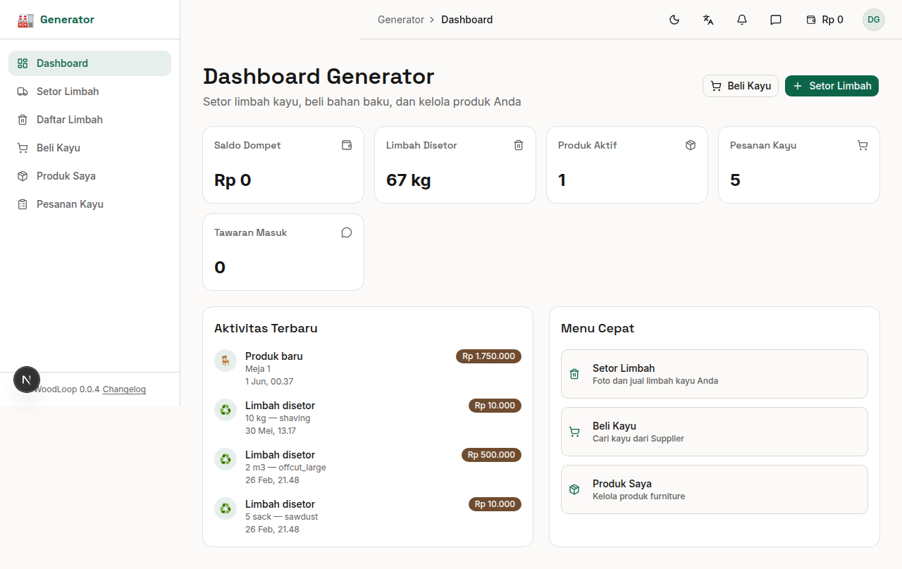

# Bab 9: Produk Saya

---

Generator dapat mendaftarkan **produk furnitur atau kerajinan kayu** yang dijual melalui halaman Produk Saya.

*Gambar 9.1 — Halaman Produk Saya*

---

## 9.1 Daftar Produk

| Kolom | Keterangan |
|-------|------------|
| **Foto** | Thumbnail foto utama produk |
| **Nama** | Nama produk |
| **Kategori** | Furniture, Custom Order, Raw Material, Lainnya |
| **Harga** | Harga jual produk |
| **Stok** | Jumlah unit tersedia |
| **Status** | Aktif, Sold Out, atau Draft |
| **Tanggal** | Tanggal dibuat |
| **Aksi** | Tombol edit / hapus |

---

## 9.2 Menambahkan Produk Baru

Klik tombol **"Tambah Produk"** untuk membuka form produk baru.

*Gambar 9.2 — Form Tambah Produk Baru*

| Field | Wajib | Keterangan |
|-------|:-----:|------------|
| **Nama Produk** | ✅ | Contoh: "Meja Jati Minimalis" |
| **Kategori** | ✅ | Pilih dari: Furniture, Custom Order, Raw Material, Lainnya |
| **Status** | ✅ | Aktif, Sold Out, atau Draft |
| **Jenis Kayu** | ❌ | Pilih jenis kayu yang digunakan |
| **Harga** | ✅ | Dalam Rupiah |
| **Stok** | ❌ | Jumlah unit tersedia (opsional) |
| **Deskripsi** | ❌ | Cerita atau spesifikasi produk |
| **Foto** | ✅ | Minimal 1 foto, maksimal 5 |

**Kategori Produk:**

| Kategori | Contoh |
|----------|--------|
| 🪑 **Furniture** | Meja, kursi, lemari, rak |
| 📐 **Custom Order** | Produk pesanan khusus |
| 🪵 **Raw Material** | Bahan baku kayu |
| 📦 **Lainnya** | Dekorasi, aksesoris |

**Upload Foto:**
- Gunakan **FileDropzone** yang tersedia (drag & drop atau klik untuk upload)
- Kamera juga bisa digunakan langsung dari perangkat mobile
- Foto akan ditampilkan sebagai thumbnail pratinjau

Setelah semua field terisi, klik **"Simpan"** untuk menyimpan produk.

---

## 9.3 Detail Produk

Klik pada nama produk untuk melihat detail lengkap:

| Informasi | Detail |
|-----------|--------|
| **Galeri Foto** | Semua foto produk dalam lightbox yang bisa diklik |
| **Nama & Kategori** | Info dasar produk |
| **Harga & Stok** | Informasi harga dan ketersediaan |
| **Deskripsi** | Penjelasan detail produk |
| **Tombol Aksi** | Edit atau Hapus produk |

> 💡 **Lightbox Galeri:** Klik foto untuk melihat dalam ukuran penuh. Geser atau klik panah untuk navigasi antar foto.

---

## 9.4 Edit & Hapus Produk

### Edit Produk

1. Klik ikon **pensil** (✏️) pada baris produk, atau klik tombol **"Edit"** di halaman detail
2. Ubah field yang diperlukan
3. Foto lama akan ditampilkan sebagai pratinjau
4. Klik **"Simpan"** untuk menyimpan perubahan

### Hapus Produk

1. Klik ikon **tong sampah** (🗑️) pada baris produk
2. Konfirmasi dialog penghapusan
3. Klik **"Hapus"** untuk mengonfirmasi

> ⚠️ Penghapusan produk bersifat permanen dan tidak dapat dibatalkan.

### Status Produk

| Status | Arti |
|--------|------|
| 🟢 **Aktif** | Produk tampil dan bisa dibeli oleh Buyer di **Marketplace Furniture** |
| 🔴 **Sold Out** | Stok habis, produk masih tampil tapi tidak bisa dibeli |
| ⚪ **Draft** | Produk tidak tampil, masih dalam penyusunan |

> 💡 **Marketplace Furniture:** Produk dengan status **Aktif** akan otomatis muncul di marketplace furniture yang bisa diakses oleh Buyer melalui menu **Furniture** di sidebar mereka. Buyer bisa melihat, menambah ke keranjang, checkout, dan melacak pesanan furniture Anda.

---
➡️ **Lanjut ke [Bab 10: Profil Generator](./10-bab-10-profil.md)**
