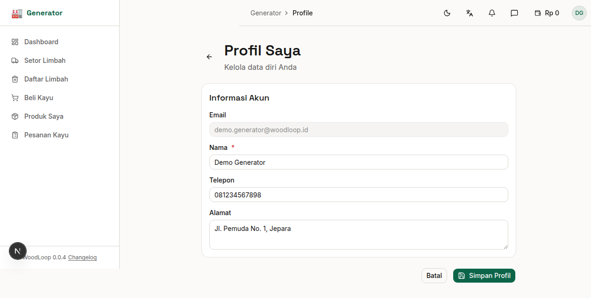

# Bab 10: Profil Generator

---

Halaman profil menampilkan informasi pribadi akun Generator dan dapat diedit sesuai kebutuhan.

*Gambar 10.1 — Halaman Profil Generator*

---

## 10.1 Informasi Profil

| Field | Keterangan |
|-------|------------|
| **Nama** | Nama lengkap atau nama usaha |
| **Email** | Alamat email terdaftar (tidak bisa diubah) |
| **No. Telepon** | Nomor kontak yang bisa dihubungi |
| **Alamat** | Alamat workshop atau tempat usaha |

---

## 10.2 Edit Profil

1. Klik tombol **"Edit Profil"**
2. Ubah field yang diperlukan:

| Field | Wajib | Keterangan |
|-------|:-----:|------------|
| **Nama** | ✅ | Nama yang akan ditampilkan ke pengguna lain |
| **No. Telepon** | ❌ | Nomor untuk koordinasi pickup |
| **Alamat** | ❌ | Alamat workshop untuk pickup limbah |

3. Klik **"Simpan"** untuk menyimpan perubahan

> **💡 Tips:** Pastikan nomor telepon dan alamat selalu terbaru agar Aggregator bisa menjemput limbah ke lokasi yang tepat.

### Menu Profil

Profil Generator dapat diakses melalui:
- **Sidebar navigasi** — Klik inisial nama di pojok kanan atas
- **Menu dropdown avatar** — Klik ikon avatar → **"Profil"**
- **URL langsung** — `/generator/profile`

---
➡️ **Lanjut ke [Bab 11: Klinik Desain](./11-bab-11-klinik-desain.md)**
