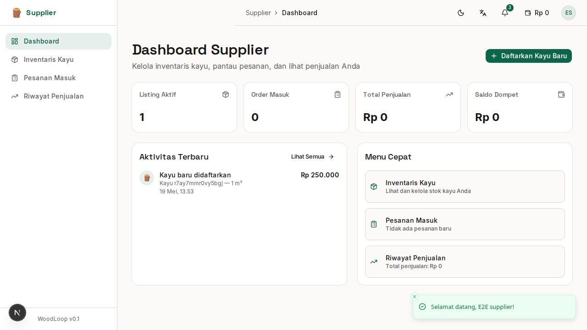

# Bab 3: Dashboard Supplier

---

Halaman Dashboard Supplier adalah halaman utama yang muncul setelah login. Dashboard menampilkan ringkasan bisnis kayu Anda dalam bentuk kartu statistik dan daftar aktivitas terbaru.


*Gambar 3.1 — Dashboard Supplier*

---

## 3.1 Ringkasan Kartu (Summary Cards)

Empat kartu statistik menampilkan data ringkas bisnis Anda:

| Kartu | Ikon | Menampilkan |
|-------|------|-------------|
| **Listing Aktif** | 📦 | Jumlah kayu yang sedang dijual (status `available`) |
| **Order Masuk** | 📋 | Jumlah pesanan dari Generator yang belum diproses |
| **Total Penjualan** | 💰 | Total pendapatan dari semua penjualan yang selesai |
| **Saldo Dompet** | 👛 | Saldo dompet digital WoodLoop Anda |

---

## 3.2 Aktivitas Terbaru

Di bawah ringkasan kartu, terdapat daftar **Aktivitas Terbaru** yang menampilkan riwayat kegiatan terkini, misalnya:

```
📦 Kayu Jati — 2.5 m³    (15 menit lalu)
📦 Kayu Mahoni — 1.0 m³  (1 jam lalu)
💰 Pesanan #a1b2c3d4      (2 jam lalu)
```

Setiap aktivitas menampilkan:
- **Ikon** — Menandakan jenis aktivitas (listing baru / order masuk / penjualan)
- **Deskripsi** — Informasi detail (jenis kayu, volume, atau nomor pesanan)
- **Waktu** — Waktu relatif sejak kejadian

---

## 3.3 Menu Cepat (Quick Actions)

Dashboard menyediakan tombol aksi cepat untuk navigasi ke halaman-halaman utama:

| Tombol | Tujuan | Fungsi |
|--------|--------|--------|
| **Daftarkan Kayu Baru** | `/supplier/inventory/new` | Buka form tambah kayu |
| **Inventaris Kayu** | `/supplier/inventory` | Lihat & kelola stok |
| **Pesanan Masuk** | `/supplier/orders` | Cek order Generator |
| **Riwayat Penjualan** | `/supplier/sales` | Lihat data penjualan |

---
➡️ **Lanjut ke [Bab 4: Inventaris Kayu](./04-bab-4-inventaris.md)**
