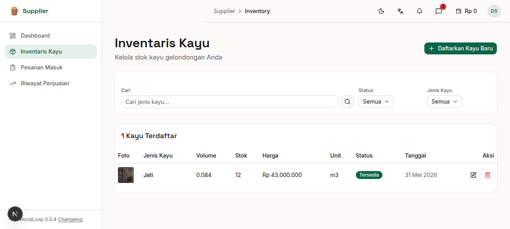
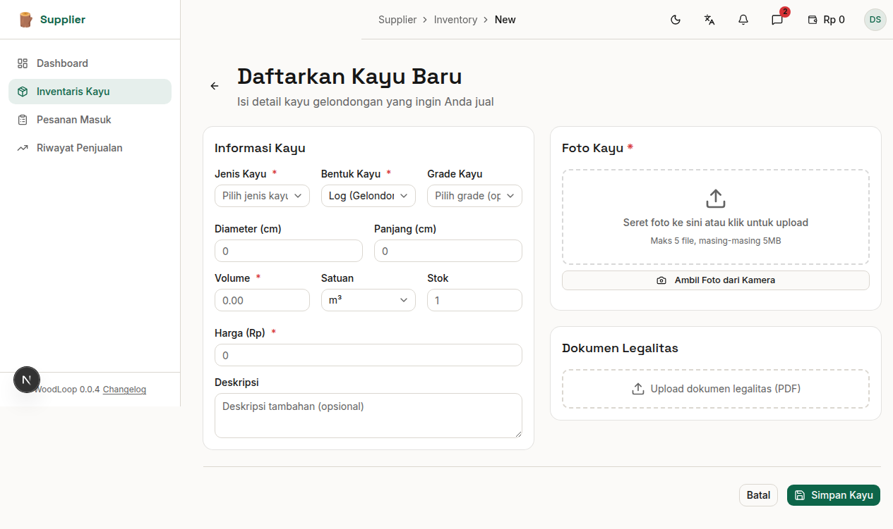

# Bab 4: Inventaris Kayu

---

Halaman **Inventaris Kayu** menampilkan semua kayu yang telah Anda daftarkan ke dalam sistem. Dari halaman ini Anda dapat melihat, mencari, menyaring, mengedit, dan menghapus listing kayu.


*Gambar 4.1 — Halaman inventaris kayu Supplier*

---

## 4.1 Melihat Daftar Inventaris

Setiap baris dalam tabel inventaris menampilkan:

| Kolom | Keterangan |
|-------|------------|
| **Foto** | Thumbnail foto utama kayu |
| **Jenis Kayu** | Nama jenis kayu (Jati, Mahoni, dll) |
| **Bentuk** | Log, Square, Balok, atau Papan |
| **Volume** | Volume kayu dalam m³ |
| **Stok** | Jumlah unit kayu tersedia |
| **Harga** | Harga per satuan dalam Rupiah |
| **Status** | 🟢 Tersedia / 🔴 Terjual |
| **Aksi** | ✏️ Edit / 🗑️ Hapus |

---

## 4.2 Filter & Pencarian

Halaman inventaris menyediakan beberapa filter untuk memudahkan pencarian:

### Filter Status

Pilih status kayu yang ingin ditampilkan:
| Opsi | Menampilkan |
|------|-------------|
| **Semua** | Seluruh listing |
| **Tersedia** | Kayu yang masih dijual |
| **Terjual** | Kayu yang sudah dibeli |

### Filter Jenis Kayu

Pilih jenis kayu spesifik dari dropdown untuk menampilkan hanya kayu dengan jenis tersebut.

### Pencarian Teks

Ketik kata kunci di kolom pencarian untuk mencari berdasarkan:
- Nama jenis kayu
- Deskripsi

### Reset Filter

Klik tombol **"Reset"** untuk menghapus semua filter dan kembali ke tampilan default.

---

## 4.3 Status Kayu

Setiap listing kayu memiliki status yang menunjukkan ketersediaannya:

| Status | Badge | Arti |
|--------|-------|------|
| **Tersedia** | 🟢 Hijau | Kayu siap dibeli oleh Generator |
| **Terjual** | 🔴 Merah | Kayu sudah dibeli dan transaksi selesai |

Status akan berubah otomatis saat Generator melakukan pemesanan.

---

## 4.4 Edit Kayu

Untuk mengubah data kayu yang sudah didaftarkan:

1. Cari kayu yang ingin diedit di tabel inventaris
2. Klik ikon **✏️ (Edit)** pada baris kayu tersebut
3. Anda akan diarahkan ke halaman edit
4. Ubah field yang diperlukan:
   - Jenis kayu
   - Bentuk kayu (otomatis mengubah input dimensi)
   - Grade kayu
   - Dimensi (diameter/panjang/lebar/tinggi)
   - Volume
   - Harga
   - Deskripsi
   - Foto (dapat menambah/menghapus)
   - Dokumen legalitas
5. Klik **"Simpan Perubahan"**
6. Notifikasi **"Kayu berhasil diperbarui"** akan muncul

### Halaman Edit Kayu


*Gambar 4.2 — Halaman edit kayu (tampilan mirip dengan form tambah)*

Field yang tersedia:

| Field | Tipe | Wajib | Keterangan |
|-------|------|:-----:|------------|
| Jenis Kayu | Dropdown | ✅ | Pilih dari daftar jenis kayu |
| Bentuk Kayu | Dropdown | ✅ | Log / Square / Balok / Papan |
| Grade Kayu | Dropdown | ❌ | Perhutani / Hutan Rakyat / Lainnya |
| Dimensi | Angka | ✅ | Menyesuaikan bentuk kayu |
| Volume | Angka | ✅ | Dihitung otomatis atau manual |
| Harga | Angka (Rp) | ✅ | Format: 1.500.000 |
| Status | Dropdown | ✅ | Tersedia / Terjual |
| Deskripsi | Textarea | ❌ | Catatan tambahan |

---

## 4.5 Hapus Kayu

Untuk menghapus listing kayu:

1. Cari kayu yang ingin dihapus di tabel inventaris
2. Klik ikon **🗑️ (Hapus)** pada baris kayu tersebut
3. Dialog konfirmasi akan muncul:

   ```
   ┌──────────────────────────────────────┐
   │ Hapus Kayu                            │
   │                                       │
   │ Apakah Anda yakin ingin menghapus     │
   │ listing kayu ini? Tindakan ini tidak  │
   │ bisa dibatalkan.                      │
   │                                       │
   │        [Batal]    [Hapus]             │
   └──────────────────────────────────────┘
   ```

4. Klik **"Hapus"** untuk mengonfirmasi
5. Data akan langsung terhapus dan tabel inventaris akan diperbarui secara otomatis
6. Klik **"Batal"** untuk membatalkan penghapusan

> ⚠️ **Penting:** Kayu yang sudah memiliki pesanan aktif **tidak bisa dihapus**. Hapus hanya untuk kayu yang belum ada peminat.

---
➡️ **Lanjut ke [Bab 5: Tambah Kayu Baru](./05-bab-5-tambah-kayu.md)**
