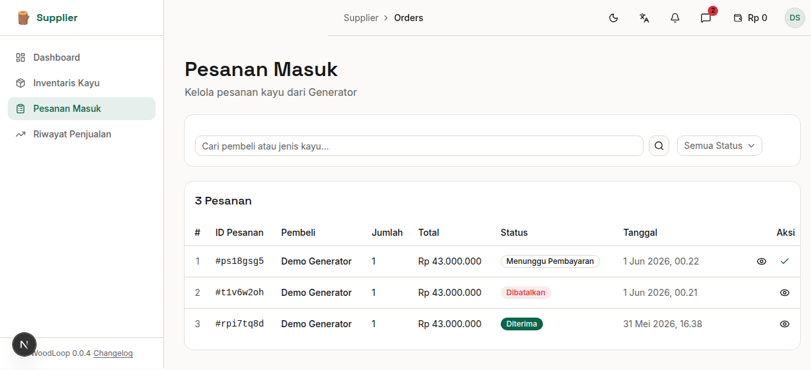
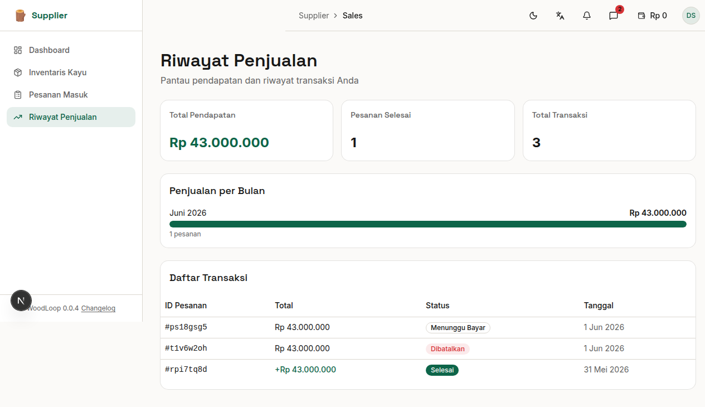

# Bab 6: Pesanan & Penjualan

---

## 6.1 Pesanan Masuk

Halaman **Pesanan Masuk** menampilkan semua pesanan (*order*) yang dibuat oleh Generator untuk membeli kayu Anda. Halaman ini dilengkapi dengan fitur pencarian, filter, serta tombol aksi untuk mengelola setiap pesanan.


*Gambar 6.1 — Halaman pesanan masuk*

Setiap baris pesanan menampilkan:

| Kolom | Keterangan |
|-------|------------|
| **#** | Nomor urut (counter) |
| **ID Pesanan** | Kode unik pesanan (contoh: `#4pwxg9f2`) |
| **Pembeli** | Nama Generator yang memesan |
| **Produk** | Jenis kayu yang dipesan |
| **Jumlah** | Volume yang dipesan |
| **Total** | Total harga pesanan |
| **Status** | Status terkini pesanan |
| **Aksi** | Tombol aksi sesuai status |

### Pencarian & Filter

Halaman pesanan masuk menyediakan fitur pencarian dan filter untuk memudahkan Anda mencari pesanan tertentu:

| Fitur | Cara Pakai |
|-------|------------|
| **🔍 Pencarian Teks** | Ketik nama pembeli atau jenis kayu di kolom pencarian |
| **📋 Filter Status** | Pilih status pesanan dari dropdown (Semua Status, Menunggu Pembayaran, Dibayar, Diproses, Dikirim, Diterima) |
| **🔄 Reset** | Klik "Reset" untuk menghapus semua filter |

---

## 6.2 Status & Aksi Pesanan

Supplier dapat mengubah status pesanan secara manual melalui tombol aksi yang tersedia di setiap baris tabel. Ini berguna ketika pembayaran dilakukan di luar sistem (transfer manual, WhatsApp, COD).

| Status | Badge | Tombol Aksi | Keterangan |
|--------|-------|-------------|------------|
| ⏳ **Menunggu Pembayaran** | Kuning | ✅ **Konfirmasi Bayar** | Generator sudah pesan. Supplier konfirmasi setelah pembayaran diterima |
| ✅ **Dibayar** | Hijau | 📦 **Proses Pesanan** | Kayu sedang disiapkan |
| 🔄 **Diproses** | Biru | 🚚 **Tandai Dikirim** | Kayu mulai dikirim |
| 🚚 **Dikirim** | Biru | — | Kayu dalam perjalanan |
| 📦 **Diterima** | Hijau | — | Generator sudah terima, transaksi selesai |
| ❌ **Dibatalkan** | Merah | — | Pesanan dibatalkan |

**Alur status pesanan:**

```
Generator pesan
      ↓
Menunggu Pembayaran ──→ [⚡ Konfirmasi Bayar] ──→ Dibayar
                                                       ↓
                                              [⚡ Proses Pesanan]
                                                       ↓
                                                   Diproses
                                                       ↓
                                              [⚡ Tandai Dikirim]
                                                       ↓
                                                   Dikirim
                                                       ↓
                                                  Diterima ✅
```

> ⚡ **Catatan:** Tombol aksi hanya muncul sesuai dengan status saat ini. Anda juga dapat membatalkan pesanan yang masih berstatus *Menunggu Pembayaran, Dibayar,* atau *Diproses*.

### Detail Pesanan

Klik ikon **👁️ (Detail)** untuk melihat informasi lengkap pesanan dalam panel samping (*sheet*). Panel ini menampilkan:

- **ID Pesanan** — Kode unik pesanan
- **Pembeli** — Nama Generator
- **Produk** — Jenis kayu
- **Jumlah** — Volume yang dipesan
- **Total Harga** — Jumlah pembayaran
- **Tanggal Pesan** — Waktu pemesanan
- **Tombol Aksi** — Tombol konfirmasi/pemrosesan yang sama

---

## 6.3 Riwayat Penjualan

Halaman **Riwayat Penjualan** menampilkan seluruh transaksi yang telah selesai beserta ringkasan pendapatan.


*Gambar 6.2 — Halaman riwayat penjualan*

### Ringkasan Kartu

| Kartu | Menampilkan |
|-------|-------------|
| 💰 **Total Pendapatan** | Jumlah rupiah dari semua penjualan yang selesai |
| ✅ **Pesanan Selesai** | Jumlah transaksi dengan status `received` |
| 🔄 **Total Transaksi** | Total semua transaksi (termasuk pending) |

### Daftar Transaksi

Tabel riwayat transaksi menampilkan:

| Kolom | Keterangan |
|-------|------------|
| **Tanggal** | Waktu transaksi dibuat |
| **Pembeli** | Nama Generator |
| **Produk** | Jenis kayu yang dibeli |
| **Volume** | Volume kayu |
| **Total** | Jumlah pembayaran |
| **Status** | Status transaksi |

> **Jika belum ada penjualan:** Halaman akan menampilkan teks **"Belum ada data penjualan"** dan grafik akan kosong.

---

## 6.4 Grafik Penjualan

Di bagian atas halaman Riwayat Penjualan, terdapat **Grafik Penjualan per Bulan** yang menampilkan tren penjualan dalam bentuk diagram batang (*bar chart*).

**Fitur grafik:**
- **Sumbu X:** Bulan (Januari, Februari, ...)
- **Sumbu Y:** Jumlah penjualan dalam Rupiah
- **Bar:** Setiap batang mewakili total penjualan di bulan tersebut

Grafik akan otomatis terisi seiring bertambahnya transaksi yang selesai.

---
➡️ **Lanjut ke [Bab 7: Profil Supplier](./07-bab-7-profil.md)**
