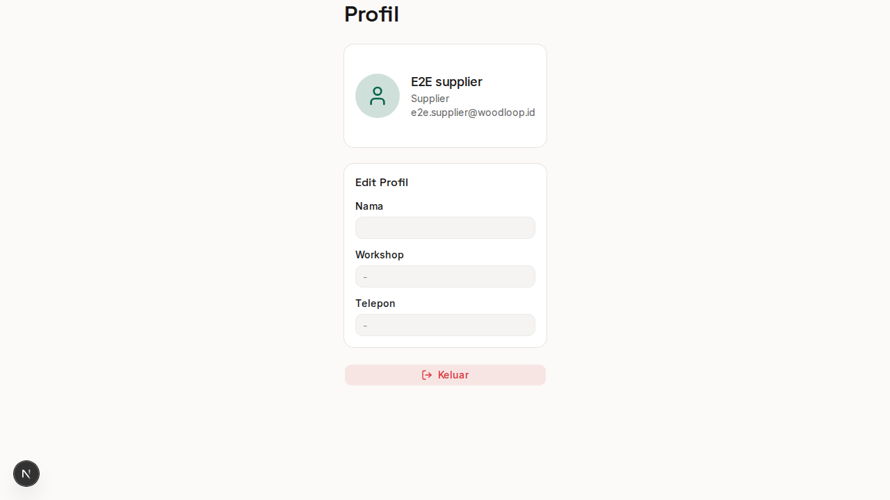

# Bab 7: Profil Supplier

---

Halaman **Profil Supplier** adalah halaman untuk mengelola data diri, lokasi workshop, dan dokumen perizinan. Halaman ini dapat diakses melalui dropdown avatar di pojok kanan atas → **Profil**.


*Gambar 7.1 — Halaman profil Supplier*

Halaman profil terdiri dari dua kolom: **Informasi Supplier** (kiri) dan **Dokumen Perizinan** (kanan).

---

## 7.1 Informasi Supplier

Form informasi Supplier berisi data dasar yang dapat diedit:

| Field | Tipe | Wajib | Contoh |
|-------|------|:-----:|--------|
| **Nama** | Text | ✅ | "UD. Kayu Jaya" |
| **Nama Workshop** | Text | ❌ | "Workshop Kayu Jaya" |
| **Telepon** | Text | ❌ | "08123456789" |

**Cara edit informasi:**
1. Ubah nilai pada field yang diinginkan
2. Klik **"Simpan Profil"** di bagian bawah
3. Notifikasi **"Profil berhasil diperbarui"** akan muncul
4. Data nama, workshop, dan telepon akan langsung berubah di sistem

---

## 7.2 Alamat & Lokasi Workshop

### Alamat

Field alamat berbentuk textarea untuk menuliskan alamat lengkap workshop Anda:

```
Jl. Pemuda No. 123, Kecamatan Jepara,
Kabupaten Jepara, Jawa Tengah 59431
```

### Lokasi GPS (Latitude & Longitude)

Koordinat lokasi workshop ditampilkan dalam format desimal:

```
Lat: -6.589100, Lng: 110.670500
```

---

## 7.3 Map Picker

Map Picker adalah peta interaktif berbasis **Leaflet** (OpenStreetMap) yang memungkinkan Anda menentukan lokasi workshop secara visual.

### Menggunakan Map Picker:

**Cara 1 — Drag Marker:**
1. Klik dan tahan marker 📍 berwarna merah di peta
2. Seret marker ke lokasi workshop Anda
3. Lepaskan untuk menetapkan posisi
4. Koordinat (Lat, Lng) akan berubah otomatis

**Cara 2 — Klik Peta:**
1. Klik di sembarang titik pada peta
2. Marker akan berpindah ke lokasi yang diklik
3. Koordinat akan berubah otomatis

**Cara 3 — Gunakan Lokasi Saya (GPS):**
1. Klik tombol **"Pakai Lokasi Saya"**
2. Browser akan meminta izin lokasi:
   ```
   "woodloop.pasarjepara.com ingin mengetahui lokasi Anda"
                           [Blokir] [Izinkan]
   ```
3. Klik **"Izinkan"**
4. Marker akan berpindah ke lokasi GPS Anda saat ini
5. Tombol akan menampilkan "Mendeteksi..." selama proses

> ⚠️ **Catatan:** Fitur GPS memerlukan izin lokasi browser. Jika ditolak, gunakan cara drag marker atau klik peta manual.

---

## 7.4 Dokumen Perizinan

Di kolom kanan halaman profil, terdapat daftar dokumen perizinan yang sudah Anda upload.

### Melihat Dokumen Existing

Dokumen yang sudah diupload ditampilkan dalam bentuk kartu:

```
┌──────────────────────────────────────────┐
│ 📄 SK Pengesahan 2026                    │
│    SK_Pengesahan          ✓ Terverifikasi │
│                           [📄] [🗑️]       │
└──────────────────────────────────────────┘
```

Setiap kartu dokumen menampilkan:
- **Ikon** 📄 — Menandakan file dokumen
- **Nama Dokumen** — Label yang Anda berikan saat upload
- **Jenis Dokumen** — Tipe dokumen (NIB, SVLK, dll)
- **Status Verifikasi** — ✓ Terverifikasi (jika sudah diverifikasi admin)
- **Tombol Buka** — Membuka file PDF di tab baru
- **Tombol Hapus** — Menghapus dokumen

**Membuka dokumen:**
Klik ikon 📄 atau nama dokumen untuk membuka file PDF di tab browser baru.

**Menghapus dokumen:**
1. Klik ikon 🗑️ pada kartu dokumen
2. Konfirmasi dengan **"OK"** pada dialog
3. Dokumen akan langsung terhapus

---

## 7.5 Upload Dokumen Baru

Untuk menambahkan dokumen perizinan baru:

### Langkah 1: Pilih Jenis Dokumen

Pilih jenis dokumen dari dropdown:

| Opsi | Deskripsi |
|------|-----------|
| **NIB** | Nomor Induk Berusaha |
| **SVLK** | Sertifikat Verifikasi Legalitas Kayu |
| **SK Pengesahan** | Surat Keterangan Pengesahan |
| **Izin Usaha** | Izin Usaha Industri / Perdagangan |
| **Sertifikat Lainnya** | Sertifikat lain yang relevan |
| **Lainnya** | Dokumen lainnya |

### Langkah 2: Nama Dokumen (Opsional)

Masukkan label/nama untuk dokumen, misalnya:
- "SK Pengesahan 2026"
- "SVLK Jati 2025"
- "NIB UD. Kayu Jaya"

### Langkah 3: Pilih File

1. Klik tombol **"File (PDF, maks 10MB)"**
2. Pilih file PDF dari komputer
3. Nama file akan tampil di samping tombol

### Langkah 4: Upload

1. Klik tombol **"Upload Dokumen"**
2. Tombol akan berubah menjadi **"Mengunggah..."** selama proses
3. Jika berhasil:
   - Notifikasi **"Dokumen berhasil diupload"**
   - Dokumen baru akan muncul di daftar
4. Jika gagal:
   - Notifikasi error akan muncul
   - Periksa ukuran file (maks 10MB) dan format (PDF)

---
➡️ **Lanjut ke [Bab 8: Troubleshooting](./08-bab-8-troubleshooting.md)**
